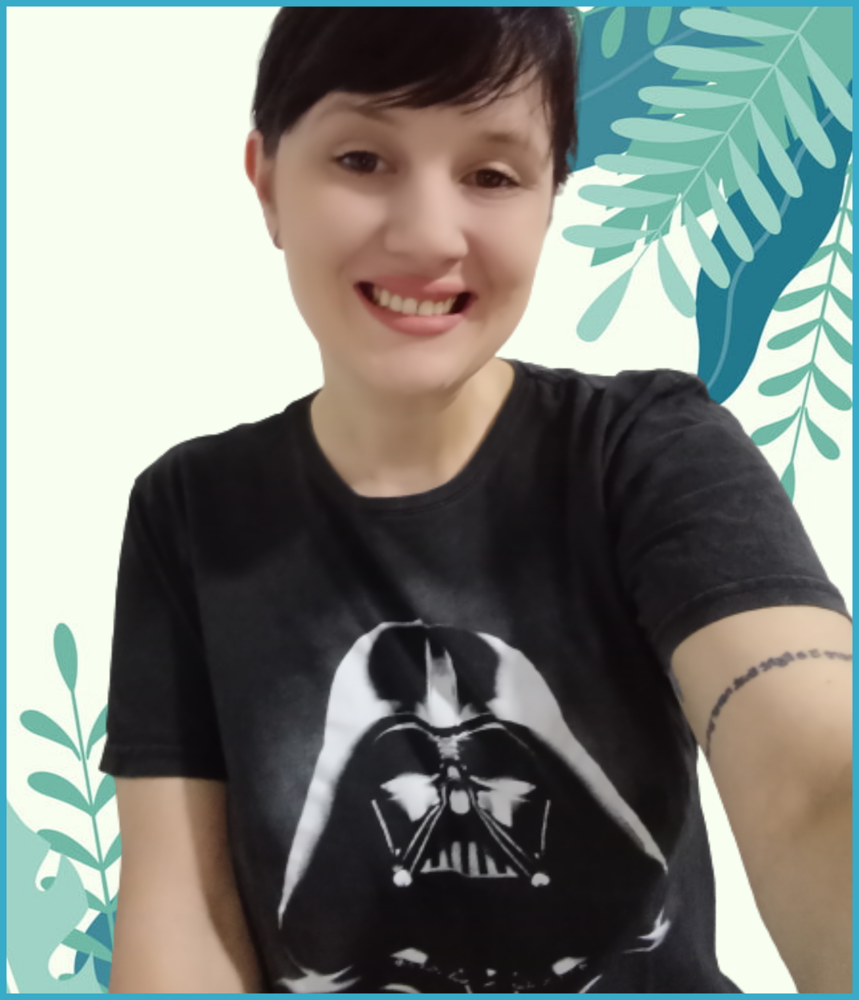

---
## Configure header of page
text_align_right: false
show_title_as_headline: false
headline: |
  EQUIPE/EQUIPO
title: Equipe/Equipo
---

# Marília Melo Favalesso

[`r icons::icon_style(icons::fontawesome("envelope", style = "solid"), fill = "#FF9933")`](mariliabioufpr@gmail.com) [`r icons::icon_style(icons::fontawesome("globe-americas", style = "solid"), fill = "#FF9933")`](www.mmfava.com) [`r icons::icon_style(icons::fontawesome("github"), fill = "#FF9933")`](https://github.com/mmfava)

|     PT    	|     ES    	|
|:---------:	|:---------:	|
| Bióloga (UFPR - Brasil), Mestre em Conservação e Manejo de Recursos Naturais (UNIOESTE - Brasil) e Doutoranda em Ecologia, Genética e Evolução (UBA - Argentina). Trabalha com o **R** desde 2016, quando atuou na área de consultoria e assessoria em bioestatística. 	| Bióloga (UFPR - Brasil), Magíster en Conservación y Manejo de Recursos Naturales (UNIOESTE - Brasil) y Estudiante de Doctorado en Ecología, Genética y Evolución (UBA - Argentina). Trabaja con **R** desde 2016 cuando realizaba labores de consultoría y asesoría en bioestadística. |

 
------------------------------------------------------
 

# Eliana Florencia Burgos

[`r icons::icon_style(icons::fontawesome("envelope", style = "solid"), fill = "#FF9933")`](burgosef@gmail.com ) [`r icons::icon_style(icons::fontawesome("github"), fill = "#FF9933")`](https://github.com/EliFMBurgos)

| PT 	| ES 	|
|:---:	|:---:	|
| Bióloga (UADER - Argentina), pós-graduanda em Biologia da Conservação (UNaM - Argentina) e doutoranda em Ecologia, Genética e Evolução (UBA - Argentina). Trabalha com o **R** desde 2018 quando começou sua pós-graduação. | Bióloga (UADER - Argentina), estudiante de la especialización en Biología de la Conservación (UNaM - Argentina) y estudiante de Doctorado en Ecología, Genética y Evolución (UBA - Argentina). Trabaja con **R** desde 2018 cuando inició sus estudios de posgrado. 	|

