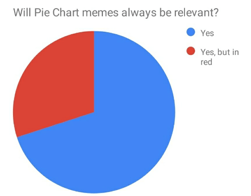
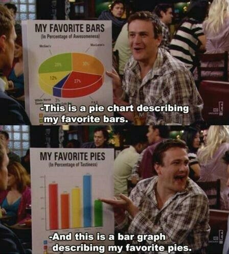

---
title: '{ES} Mejor dígalo con gráficos II'
author: "Eli-Soma_dos_Quadrados"
date: "10/5/2022"
output: html_document
---

```{r setup, include=FALSE}
knitr::opts_chunk$set(echo = TRUE)
```

## Gráficos para variables cualitativas.

**Piechart**

El **piechart** o **gráfico de tortas** es un grafico circular divido en secciones que muestran la proporcion relativa de las variables graficadas.

{width="423"}

Siguiendo con nuestro ejemplo del post anterior, vamos a graficar las frecuencias de nuestros tratamientos.

```{r message=FALSE, warning=FALSE}
tratamiento <- as.factor(sample(c("A","B", "C", "D"), size =30, replace = TRUE))  # creo mi vector aleatorio con la variable cualitativa
frec.tratam <-  table(tratamiento) # calculo las frecuencias
pie(frec.tratam) # hago el gráfico de tortas
```

Podemos modificar el gráfico para que tenga bordes de la siguienta manera:

```{r message=FALSE, warning=FALSE}
pie(frec.tratam, edges=10) # modifico los bordes
```

También podemos cambiar los colores, siempre recordando que el programa nos reconoce los niveles de la variable en orden alfabetico o de menor a mayor (las ordena).

```{r message=FALSE, warning=FALSE}
pie(frec.tratam, # grafico de torta
    edges=10, # cmodifico los bordes
    col = c("black", "grey", "blue", "red")) # le cambio los colores
```

Si quisieramos agregarle un entramado usamos los mismos códigos que para el comando `barplot()`: `density=` y `angle=`.

```{r message=FALSE, warning=FALSE}
 pie(frec.tratam, # gráfico de torta
    edges=10, # modifico los bordes
    col = c("black", "grey", "blue", "red"),# cambio los colores
    density = c(10,15,20,25),# cantidad de lineas para el entramado
        angle= c(0,90,11,36))# direccion del entramado
```

En este caso, los nombres de los niveles ya son brindados por el mismo comando, pero si quisieramos cambiarlos para que sean más representativos o ponerlos en otro idioma diferente al que tenemos en nuestra base de datos, podemos hacerlo con el comando `labels=c()` y colocamos los nombres en el mismo orden en el cual el programa los reconoce, en este ejemplo, para "A", corresponde el nombre "Trat-A", y así continúo en orden con los demás.

```{r message=FALSE, warning=FALSE}
pie(frec.tratam, # gráfico de torta
    edges=10, # modifico los bordes
    col = c("black", "grey", "blue", "red"), # cambio los colores
    density = c(10,15,20,25), # cantidad de lineas para el entramado
        angle= c(0,90,11,36), # direccion del entramado,
    labels=c("Trat-A", "Trat-B", "Trat-C", "Trat-D")) # cambio los nombres de los niveles
```

**Piechart con ggplot2**

Recordemos que para graficar en **ggplot2** tenemos que configuar nuestra base de datos como un data frame.

Con esta libreria, hacer un gráfico de tortas lleva un poco más de programación, ya que primero necesitamos realizar un gráfico de barras y luego con el comando `coord_polar()` le damos forma circular.

```{r message=FALSE, warning=FALSE}
frec.tratam <- as.data.frame(frec.tratam) # convierto en data frame mi tabla
library(ggplot2)
ggplot(frec.tratam, aes(x="", y=Freq, fill=tratamiento)) + # defino los valores a graficar
  geom_bar(stat="identity", width=1) + # defino la geometria del gráfico
  coord_polar("y", start=0)#lo cambio a gráfico circular
```

Ahora tenemos que sacarle el fondo gris y los valores de los ejes:

```{r message=FALSE, warning=FALSE}
ggplot(frec.tratam, aes(x="", y=Freq, fill=tratamiento)) + #defino los valores a graficar
  geom_bar(stat="identity", width=1) + #defino la geometria del gráfico
  coord_polar("y", start=0)+ # lo cambio a gráfico circular
  theme_void() # le saco el fondo y los ejes
```

Y acá es donde tenemos que escribir un par de códigos por separado. Para poder agregarle los nombres de los niveles en el gráfico y eliminar la leyenda, necesitamos calcular la posicion de cada nivel en el eje. Para ello necesitamos la ayuda del paquete **dplyr**

Entonces primero hacemos el calculo de la posicion de cada nivel:

```{r message=FALSE, warning=FALSE}
library(dplyr)
data <- frec.tratam %>% # nuestra base de datos
  arrange(desc(tratamiento)) %>% # ordena las filas por variable
  mutate(prop = Freq / sum(frec.tratam$Freq) *100) %>% # agrega columnas 
  mutate(ypos = cumsum(prop)- 0.5*prop) # agrega columnas 
```

Ahora, graficamos nuestro piechart con los nombres de nuestros niveles.

```{r message=FALSE, warning=FALSE}
ggplot(data, aes(x="", y=prop, fill=tratamiento)) +
  geom_bar(stat="identity", width=1, color="white") +
  coord_polar("y", start=0) +
  theme_void() + 
  theme(legend.position="none") +
  geom_text(aes(y = ypos, label = tratamiento), color = "white", size=6)
```

Y si quiero, puedo cambiarle los colores:

```{r message=FALSE, warning=FALSE}
ggplot(data, aes(x="", y=prop, fill=tratamiento)) +
  geom_bar(stat="identity", width=1, color="white") +
  coord_polar("y", start=0) +
  theme_void() + 
  theme(legend.position="none") +
  geom_text(aes(y = ypos, label = tratamiento), color = "white", size=6) +
  scale_fill_manual(values = c("black", "grey", "blue", "red"))
```

**Críticas al piechart**

Muchos/as han desaconsejado el uso del gráfico de torta o piechart, debido a que en algunas ocasiones las diferencias en las proporciones de cada nivel no son tan fácilmente diferenciables.

Si no me crees, mirá el ejemplo de este link y te vas a convencer <https://www.data-to-viz.com/caveat/pie.html>

Han surgido algunas alternativas que podrían ser más recomendables. Vamos a ver un par de ejemplos.

**Donutchart**

Si bien puede sufrir los mismos problemas que el piechart, en algunas ocasiones puede ser superador.

Vamos a construirlo con ggplot2, que si bien no existe un comando para graficarlo directamente, hay que programar las modificaciones como hicimos para el piechart.

Entonces partiendo de nuestro data frame, vamos a calcular las proporciones de cada nivel de nuestra variable "tratamiento"

```{r message=FALSE, warning=FALSE}
frec.tratam2 <- frec.tratam %>% # data frame
  arrange (desc(tratamiento)) %>% # orden descendente de nuestros niveles
  mutate(prop = Freq / sum(Freq)) %>% # calculamos las frecuencias relativas
  mutate(ymax = cumsum(prop)) %>% # las frecuencias acumuladas
  mutate(ymin = c(0, head(ymax, n=-1)))
```

Ahora graficamos. Vamos por parte para que se visualice cada codigo lo que hace:

```{r message=FALSE, warning=FALSE}
ggplot(frec.tratam2, aes(ymax=ymax, ymin=ymin, xmax=4, xmin=3, fill=tratamiento)) + #definimos los valores que vamos a graficar
  geom_rect() #definimos la geometría
```

Ahora lo confiruramos para que sea circular:

```{r message=FALSE, warning=FALSE}
ggplot(frec.tratam2, aes(ymax=ymax, ymin=ymin, xmax=4, xmin=3, fill=tratamiento)) + #definimos los valores que vamos a graficar
  geom_rect()+#definimos la geometría
  coord_polar(theta="y") #modificamos a forma circular
```

Le damos forma de "dona":

```{r message=FALSE, warning=FALSE}
ggplot(frec.tratam2, aes(ymax=ymax, ymin=ymin, xmax=4, xmin=3, fill=tratamiento)) + #definimos los valores que vamos a graficar
  geom_rect()+#definimos la geometría
  coord_polar(theta="y")+ #modificamos a forma circular
  xlim(c(2, 4)) #definimos el centro
```

Y le sacamos el fondo gris y los datos de los ejes que no necesitamos:

```{r message=FALSE, warning=FALSE}
ggplot(frec.tratam2, aes(ymax=ymax, ymin=ymin, xmax=4, xmin=3, fill=tratamiento)) + #definimos los valores que vamos a graficar
  geom_rect()+#definimos la geometría
  coord_polar(theta="y")+ #modificamos a forma circular
  xlim(c(2, 4)) + #definimos el centro
  theme_void() #eliminamos el fondo gris y los valores
```

Y por último le agregamos los nombres de los niveles en el lugar que corresponden, para eso calculamos la posicion de los niveles:

```{r message=FALSE, warning=FALSE}
frec.tratam2 <- frec.tratam2 %>% #data frame
  mutate(labelposition= (ymax + ymin) / 2)%>%
  mutate(label= paste0(tratamiento, "\n value: ",Freq))
  
```

Y ahora los graficamos,sacamos la leyenda y le cambiamos el color. También podemos "afinar" nuestro gráfico y para eso solo debemos cambiar los valores del comando `xlim()`. Veamos:

```{r message=FALSE, warning=FALSE}
ggplot(frec.tratam2, aes(ymax=ymax, ymin=ymin, xmax=4, xmin=3, fill=tratamiento)) + #definimos los valores que vamos a graficar
  geom_rect()+#definimos la geometría
  coord_polar(theta="y")+ #modificamos a forma circular
  xlim(c(-1, 4)) + #definimos el centro
  theme_void()+ #eliminamos el fondo gris y los valores
  geom_label( x=3.5, aes(y=labelposition, label=label), size=3) + #definimos las etiquetas
  theme(legend.position = "none")+#eliminamos la leyenda
   scale_fill_brewer(palette=4)# cambiamos la paleta de colores
```

**Lollipop**

Es básicamente un gráfico de barras en el que cambiamos las barras por segmentos y puntos.

```{r message=FALSE, warning=FALSE}
ggplot(frec.tratam, aes(x=tratamiento, y=Freq)) + #definimos los valores
  geom_point() + #graficamos los puntos
  geom_segment( aes(x=tratamiento, xend=tratamiento, y=0, yend=Freq))+ #unimos el eje x con los puntos
  scale_y_continuous(breaks = c(0,1,2,3, 4,5, 6,7,8,9,10)) #definimos las marcas del eje y
```

Podemos modificar el color y tamaño de los puntos:

```{r message=FALSE, warning=FALSE}
ggplot(frec.tratam, aes(x=tratamiento, y=Freq)) + #definimos los valores
  geom_point( size=5, color="red", alpha=0.7) + #graficamos los puntos
  geom_segment( aes(x=tratamiento, xend=tratamiento, y=0, yend=Freq))+ #unimos el eje x con los puntos
  scale_y_continuous(breaks = c(0,1,2,3, 4,5, 6,7,8,9,10)) #definimos las marcas del eje y
```

Podemos modificar las formas del punto, al agregar en `aes(shape=)` en el renglor de geometria:

```{r message=FALSE, warning=FALSE}
ggplot(frec.tratam, aes(x=tratamiento, y=Freq)) + #definimos los valores
  geom_point(aes(shape= tratamiento), size=5, color="red", alpha=0.7) + #graficamos los puntos
  geom_segment( aes(x=tratamiento, xend=tratamiento, y=0, yend=Freq))+ #unimos el eje x con los puntos
  scale_y_continuous(breaks = c(0,1,2,3, 4,5, 6,7,8,9,10)) #definimos las marcas del eje y
```

También podemos cambiarle el formato del segmento, engrosar la línea, ponerle color o hacerla punteada:

```{r message=FALSE, warning=FALSE}
ggplot(frec.tratam, aes(x=tratamiento, y=Freq)) + #definimos los valores
  geom_point(aes(shape= tratamiento), size=5, color="red", alpha=0.7) + #graficamos los puntos
  geom_segment( aes(x=tratamiento, xend=tratamiento, y=0, yend=Freq), size=1, color= "blue", linetype= "dotdash")+ #ual agregarle size, color, y linetype puedo cambiar el tamaño, color y tipo de linea.
  scale_y_continuous(breaks = c(0,1,2,3, 4,5, 6,7,8,9,10)) #definimos las marcas del eje y

```

**Treemap**

Este gráfico de la libreria`treemap` permite graficar relaciones jerarquicas de los niveles de una variable.

Esto gráficos se originaron para visualizar la estructura y tamaño de los archivos en el disco duro de un ordenador, pero han sido aplicados a diferentes áreas y ejemplos.

Permiten visualizar una garan cantidad de datos en espacio reducido y de forma visualmente sencilla.

Su progamación es muy sencilla, y dado que en el ejemplo que estamos realizando tenemos pocos datos, veamos la base de su programación:

```{r message=FALSE, warning=FALSE}
library(treemap)
treemap(frec.tratam,#nuestro data frame
        index="tratamiento", #la colunmna con la variable cualitativa
        vSize="Freq",#la columna con la variable numérica
        type="index" #determinamos como coloreamos los rectangulos, en este caso los va a colorear de acuerdo a nuestros niveles de la columna "tratamiento"
)
```

Se pueden agregar subniveles, cambiar los colores, nombres de las etiquetas, los bordes, entre otros cambios que pueden hacerse. Si les interesan estos gráficos, pueden consultar este link <https://r-graph-gallery.com/236-custom-your-treemap.html> para ver mas opciones de programación.

## ¡Y FÍN!

Pero cuéntanos, ¿Te gusta trabajar con gráficos? ¿Cuál es tu favorito? ¿Cuál quieres ver aquí en el blog? ¡Deja la sugerencia en nuestras redes sociales ([twitter](https://twitter.com/somaquadrados)/[instagram](https://www.instagram.com/somaquadrados/)). 


