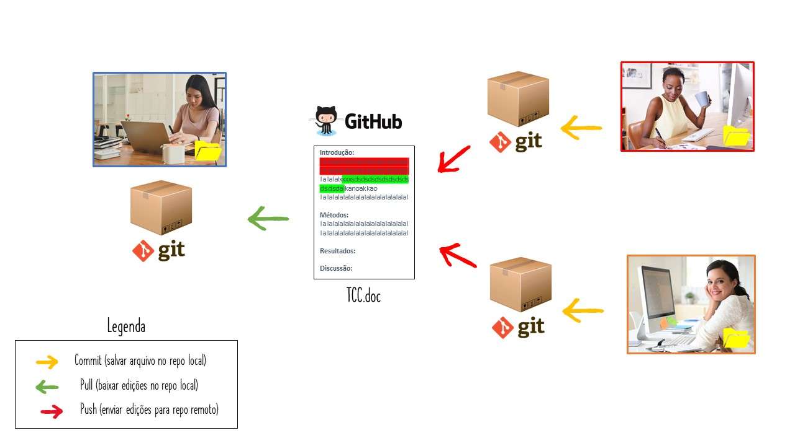
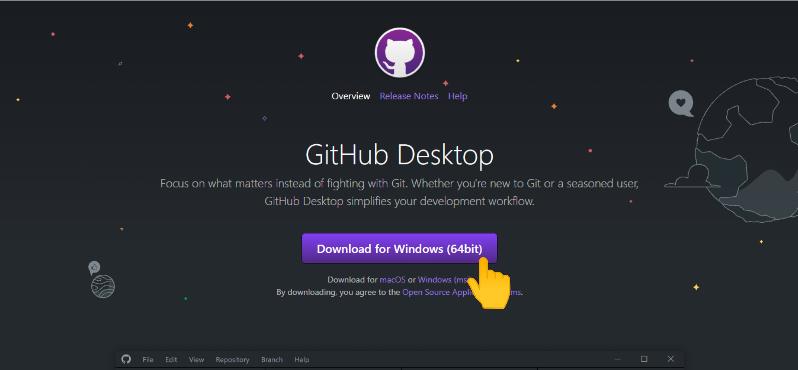
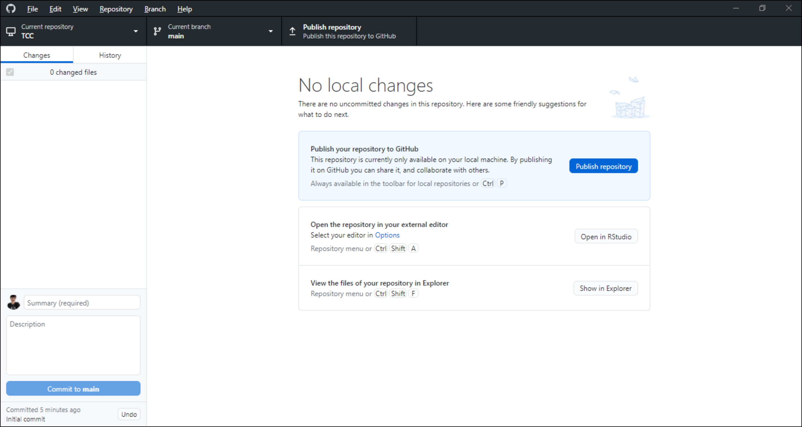
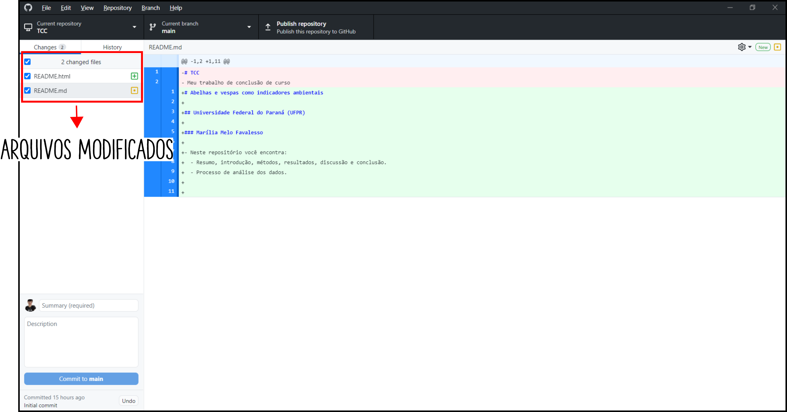
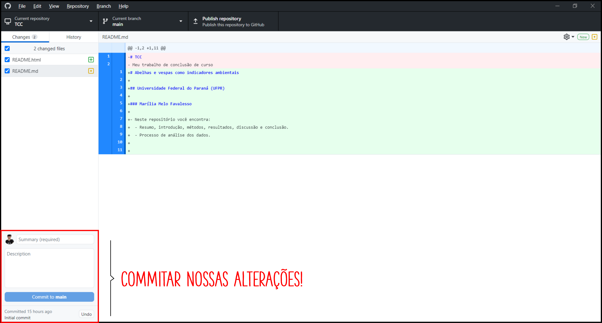
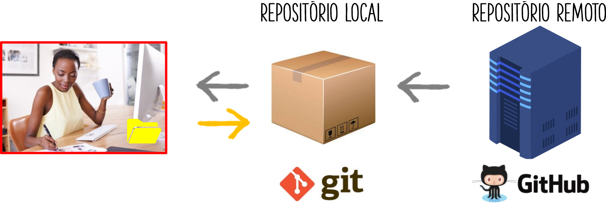

```{r setup, include=FALSE}
options(htmltools.dir.version = FALSE)
knitr::opts_chunk$set(
  fig.width=9, fig.height=3.5, fig.retina=3,
  out.width = "100%",
  cache = FALSE,
  echo = TRUE,
  message = FALSE, 
  warning = FALSE,
  hiline = TRUE
)
```

# Marília Melo Favalesso 

Ecoepidemiologista e entusiasta da ciência de dados/bioestatística

**Projetos**
- [GECD](https://github.com/gecdfoz/GECD)
- [Soma dos Quadrados](https://www.somaquadrados.com/)

**Contatos**
- `r icons::icon_style(icons::fontawesome("envelope", style = "solid"), fill = "#000000")` [mariliabioufpr@gmail.com](mariliabioufpr@gmail.com)
- `r icons::icon_style(icons::fontawesome("globe-americas", style = "solid"), fill = "#000000")` [www.mmfava.com](www.mmfava.com)
- `r icons::icon_style(icons::fontawesome("twitter"), fill = "#000000")` [Twitter: @mmfbee](https://twitter.com/mmfbee)
- `r icons::icon_style(icons::fontawesome("github"), fill = "#000000")` [Github: mmfava](https://github.com/mmfava)

---
<br>
<br>
.center[

]

---
<br>
<br>
.center[

]

---
<br>
<br>
.center[

]

---
<br>
<br>
.center[

]

---
<br>
<br>
.center[

]

---
<br>
<br>
.center[

]

---
<br>
<br>
.center[

]

---
<br>
<br>
.center[

]

---
<br>
<br>
.center[

]

---
<br>
<br>
.center[

]

---
<br>
<br>
.center[

]

---
<br>
<br>
.center[

]

---
<br>
<br>
.center[

]

---
<br>

.center[

]

---
<br>

.center[

]

---
<br>
<br>
.center[

]

---
<br>
<br>
.center[

]

---
<br>
<br>
.center[

]

---
<br>

.center[

]

---
<br>

.center[

]

---
<br>

.center[

]

---
<br>

.center[

]

---
<br>

.center[

]

---
<br>

.center[

]

---
<br>
<br>
<br>

.center[

]

---
## Pré-requisitos `r icons::icon_style(icons::fontawesome("git-square"), fill = "#000000")` 

-   Instalar o [GitHub desktop](https://desktop.github.com/)

.center[

]

---
## Pré-requisitos  `r icons::icon_style(icons::fontawesome("git-square"), fill = "#000000")` 

.center[


❤️
]

---
## Pré-requisitos  `r icons::icon_style(icons::fontawesome("git-square"), fill = "#000000")` 
.center[

<div class="background" style="width: 1000px; height: 445px; white-space: nowrap; overflow-x: scroll; border: 0; padding: 10px;">


😓
]

---
## Pré-requisitos  `r icons::icon_style(icons::fontawesome("github"), fill = "#000000")` 
-   Fazer uma conta no [GitHub](https://github.com/). 
  - Se você é estudande, pode usar o seu e-mail institucional para obter alguns beneficios com o [GitHub Student Developer Pack](https://education.github.com/pack).
  
.center[

]

---
## Pré-requisitos  `r icons::icon_style(icons::fontawesome("github"), fill = "#000000")` 

-   Fazer uma conta no [GitHub](https://github.com/). 
  - Se você é estudande, pode usar o seu e-mail institucional para obter alguns beneficios com o [GitHub Student Developer Pack](https://education.github.com/pack).
  
.center[

]

---
## Pré-requisitos  `r icons::icon_style(icons::fontawesome("git-square"), fill = "#000000")` 
.center[

<button type="submit">File</button> > <button type="submit">Options...</button> > <button type="submit">Accounts</button>

<div class="background" style="width: 1000px; height: 450px; white-space: nowrap; overflow-x: scroll; border: 0; padding: 10px;">


]

---
## Pré-requisitos `r icons::icon_style(icons::fontawesome("git-square"), fill = "#000000")`

.center[
<div class="background" style="width: 1000px; height: 420px; white-space: nowrap; overflow-x: scroll; border: 0; padding: 30px;">


]

---
## Pré-requisitos  `r icons::icon_style(icons::fontawesome("github"), fill = "#000000")` 
.center[
<div class="background" style="width: 1000px; height: 430px; white-space: nowrap; overflow-x: scroll; border: 0; padding: 30px;">


Pronto! 😋 
]

---
class: center

<br>


**Tudo pronto para começarmos a trabalhar com o Git e o GitHub**

---
## Criar um repositório

<br>

.center[

]

---
## Criar um repositório (local) `r icons::icon_style(icons::fontawesome("git-square"), fill = "#000000")`

.center[

<div class="background" style="width: 1000px; height: 420px; white-space: nowrap; overflow-x: scroll; border: 0; padding: 30px;">

 <br>

**Prestar bastante atenção no "endereço" que você vai salvar o repositório!** <br>
**Cuidado para não repetir nomes**

]

---
## Criar um repositório (local) `r icons::icon_style(icons::fontawesome("git-square"), fill = "#000000")`

.center[

]

---
## Criar um repositório (local) `r icons::icon_style(icons::fontawesome("git-square"), fill = "#000000")`

.center[

]

---
## Criar um repositório (local) 

### README.md {`r icons::icon_style(icons::fontawesome("github"), fill = "#000000")`}

.center[

]

---
## Criar um repositório (local) 

### Para editar o texto do README.md: `r icons::icon_style(icons::fontawesome("git-square"), fill = "#000000")` → `r icons::icon_style(icons::fontawesome("github"), fill = "#000000")`

- Descrição realizada em **Markdown**

.center[

]

  - Uma linguagem de *marcação simples*, **não** de programação.
  
  - Textos com caracteres não alfabéticos (**#**, **\**, **\***, **!**, **[]** e **()**), que são usados para configurar *títulos*, *listas*, *itálico*, *negrito* e inserir *imagens*. 
  
  - Creado originalmente por [John Gruber](https://en.wikipedia.org/wiki/John_Gruber) y [Aaron Swartz](https://pt.wikipedia.org/wiki/Aaron_Swartz).

---
## Criar um repositório 

### Para editar o texto do README.md: `r icons::icon_style(icons::fontawesome("git-square"), fill = "#000000")` → `r icons::icon_style(icons::fontawesome("github"), fill = "#000000")`

.center[

]

> *Parágrafo 1 `<br>` Parágrafo 2* **=**

> Parágrafo 1 <br> Parágrafo 2

---
## Criar um repositório 

### Para editar o texto do README.md: `r icons::icon_style(icons::fontawesome("git-square"), fill = "#000000")` → `r icons::icon_style(icons::fontawesome("github"), fill = "#000000")`

.center[

]

---
## Criar um repositório 

### Para editar o texto do README.md: `r icons::icon_style(icons::fontawesome("git-square"), fill = "#000000")` → `r icons::icon_style(icons::fontawesome("github"), fill = "#000000")`

.center[


**Não esqueça de salvar!**
]

---
## Criar um repositório `r icons::icon_style(icons::fontawesome("git-square"), fill = "#000000")`

### Git já identificou as mudanças feitas! 

.center[

]

---
## Criar um repositório `r icons::icon_style(icons::fontawesome("git-square"), fill = "#000000")`

### Git já identificou as mudanças feitas!

.center[

<div class="background" style="width: 1000px; height: 400px; white-space: nowrap; overflow-x: scroll; border: 0; padding: 30px;">


]

---
## Criar um repositório `r icons::icon_style(icons::fontawesome("git-square"), fill = "#000000")`

### Git já identificou as mudanças feitas!
<br>

.center[

]

---
## Criar um repositório `r icons::icon_style(icons::fontawesome("git-square"), fill = "#000000")`

### Git já identificou as mudanças feitas!

.center[

<div class="background" style="width: 1000px; height: 400px; white-space: nowrap; overflow-x: scroll; border: 0; padding: 30px;">


]

---
## Criar um repositório `r icons::icon_style(icons::fontawesome("git-square"), fill = "#000000")`

### Git já identificou as mudanças feitas!
<br>

.center[

]

---
## Criar um repositório `r icons::icon_style(icons::fontawesome("git-square"), fill = "#000000")`

### *Commitar* as nossas mudanças (local)

<div class="background" style="width: 1000px; height: 400px; white-space: nowrap; overflow-x: scroll; border: 0; padding: 30px;">

.center[

]

---
## Criar um repositório `r icons::icon_style(icons::fontawesome("git-square"), fill = "#000000")`

### *Commitar* as nossas mudanças (local)

.center[

]

---
## Criar um repositório `r icons::icon_style(icons::fontawesome("git-square"), fill = "#000000")`

### *Commitar* as nossas mudanças (local)

.center[

]

---
## Criar um repositório `r icons::icon_style(icons::fontawesome("git-square"), fill = "#000000")`

### Ver o *commit* no histórico 

.center[

]

---
## Criar um repositório `r icons::icon_style(icons::fontawesome("git-square"), fill = "#000000")`

### Ver o *commit* no histórico 
<br>

.center[

]

---
## Criar um repositório `r icons::icon_style(icons::fontawesome("git-square"), fill = "#000000")`

### Ver o *commit* no histórico 
<br>

.center[

]

---
## Criar um repositório `r icons::icon_style(icons::fontawesome("git-square"), fill = "#000000")`

### Ver o *commit* no histórico 
<br>

.center[

]

---
## Criar um repositório `r icons::icon_style(icons::fontawesome("github"), fill = "#000000")`

### Envie o repositório local para o remoto: `PUSH`
<br>

.center[

]

---
## Criar um repositório `r icons::icon_style(icons::fontawesome("git-square"), fill = "#000000")`

### Envie o repositório local para o remoto: `PUSH`

<div class="background" style="width: 1000px; height: 400px; white-space: nowrap; overflow-x: scroll; border: 0; padding: 30px;">

.center[

]

---
## Criar um repositório `r icons::icon_style(icons::fontawesome("git-square"), fill = "#000000")`

### Envie o repositório local para o remoto: `PUSH`

.center[

]

---
## Criar um repositório `r icons::icon_style(icons::fontawesome("git-square"), fill = "#000000")`

### Envie o repositório local para o remoto: `PUSH`

.center[

]

---
## Criar um repositório `r icons::icon_style(icons::fontawesome("github"), fill = "#000000")`

### Envie o repositório local para o remoto: `PUSH`

.center[

]

---
## Adicionar novo conteúdo ao meu repositório `r icons::icon_style(icons::fontawesome("git-square"), fill = "#000000")`

.center[

]

---
## Adicionar novo conteúdo ao meu repositório `r icons::icon_style(icons::fontawesome("git-square"), fill = "#000000")`

<br>

.center[

]

---
## Adicionar novo conteúdo ao meu repositório `r icons::icon_style(icons::fontawesome("github"), fill = "#000000")`

<br>

.center[

]

---
## Baixar um projeto para o meu repositório local

<br>

.center[

]

---
## Baixar um projeto para o meu repositório local

<br>

.center[

]

---
## Baixar um projeto para o meu repositório local `r icons::icon_style(icons::fontawesome("github"), fill = "#000000")`

.center[

]

---
## Baixar um projeto para o meu repositório local `r icons::icon_style(icons::fontawesome("git-square"), fill = "#000000")`

### `git CLONE`

.center[

]

---
## Baixar um projeto para o meu repositório local `r icons::icon_style(icons::fontawesome("git-square"), fill = "#000000")`
<br>

.center[

]

---
## Baixar um projeto para o meu repositório local `r icons::icon_style(icons::fontawesome("git-square"), fill = "#000000")`

.center[

]

---
## Envie a colaboração feita para o projeto remoto
<br>

.center[

]

---
## Envie a colaboração feita para o projeto remoto `r icons::icon_style(icons::fontawesome("git-square"), fill = "#000000")`

.center[

]

---
## Envie a colaboração feita para o projeto remoto

.center[

]

---
## Envie a colaboração feita para o projeto remoto `r icons::icon_style(icons::fontawesome("git-square"), fill = "#000000")`

.center[

]

---
## Envie a colaboração feita para o projeto remoto `r icons::icon_style(icons::fontawesome("git-square"), fill = "#000000")`

### `Pull request`

<div class="background" style="width: 1000px; height: 400px; white-space: nowrap; overflow-x: scroll; border: 0; padding: 30px;">

.center[

]

---
## Envie a colaboração feita para o projeto remoto `r icons::icon_style(icons::fontawesome("github"), fill = "#000000")`

### `Pull request`

<div class="background" style="width: 1000px; height: 400px; white-space: nowrap; overflow-x: scroll; border: 0; padding: 30px;">

.center[

]

---
## Envie a colaboração feita para o projeto remoto `r icons::icon_style(icons::fontawesome("github"), fill = "#000000")`

### `Pull request` 

<div class="background" style="width: 1000px; height: 400px; white-space: nowrap; overflow-x: scroll; border: 0; padding: 30px;">

.center[

]

---
## Envie a colaboração feita para o projeto remoto `r icons::icon_style(icons::fontawesome("github"), fill = "#000000")`

### `Pull request` 

<div class="background" style="width: 1000px; height: 400px; white-space: nowrap; overflow-x: scroll; border: 0; padding: 30px;">

.center[
]

---
## Envie a colaboração feita para o projeto remoto `r icons::icon_style(icons::fontawesome("github"), fill = "#000000")`

### `Pull request` 

<div class="background" style="width: 1000px; height: 400px; white-space: nowrap; overflow-x: scroll; border: 0; padding: 30px;">

.center[
]

---
## Envie a colaboração feita para o projeto remoto `r icons::icon_style(icons::fontawesome("github"), fill = "#000000")`

.center[
]

---
## Colaborações de terceiro em meu projeto `r icons::icon_style(icons::fontawesome("git-square"), fill = "#000000")`

.center[
]

---
## Colaborações de terceiro em meu projeto `r icons::icon_style(icons::fontawesome("git-square"), fill = "#000000")`

.center[
]

---
## Colaborações de terceiro em meu projeto `r icons::icon_style(icons::fontawesome("git-square"), fill = "#000000")`

.center[
]

---
## Colaborações de terceiro em meu projeto `r icons::icon_style(icons::fontawesome("git-square"), fill = "#000000")`

.center[
]

---
## Colaborações de terceiro em meu projeto `r icons::icon_style(icons::fontawesome("git-square"), fill = "#000000")`

.center[
]

---
## Agora é só continuar trabalhando! `r icons::icon_style(icons::fontawesome("git-square"), fill = "#000000")`

.center[
<div class="background" style="width: 1000px; height: 420px; white-space: nowrap; overflow-x: scroll; border: 0; padding: 30px;">

]

---
## Agora é só continuar trabalhando! `r icons::icon_style(icons::fontawesome("git-square"), fill = "#000000")`

.center[
<div class="background" style="width: 1000px; height: 420px; white-space: nowrap; overflow-x: scroll; border: 0; padding: 30px;">

]

---
## Agora é só continuar trabalhando! `r icons::icon_style(icons::fontawesome("git-square"), fill = "#000000")`

.center[
]

---
class: center, middle


## 💙💚💛 Obrigada 🧡💜🖤


