class: center, middle

```{r global_options, include=FALSE}
knitr::opts_chunk$set(fig.path = 'assets/chunks/', cache.path = "assets/cache/", dpi = 300)
library(tidyverse)
theme_set(theme_grey(base_size = 16))
library(emo)
#devtools::install_github("ropenscilabs/icon")
#devtools::install_github("hadley/emo")
```

## Bienvenid@!!

### ¡Somos la **Soma dos Quadrados**! 

¡Nuestro proyecto tiene como objetivo promover la bioestadística y una programación sencilla para los profesionales del gran área de las ciencias biológicas!

.center[]

Para más informaciones: [https://www.somaquadrados.com/](https://www.somaquadrados.com/)

---
## Introducción

.center[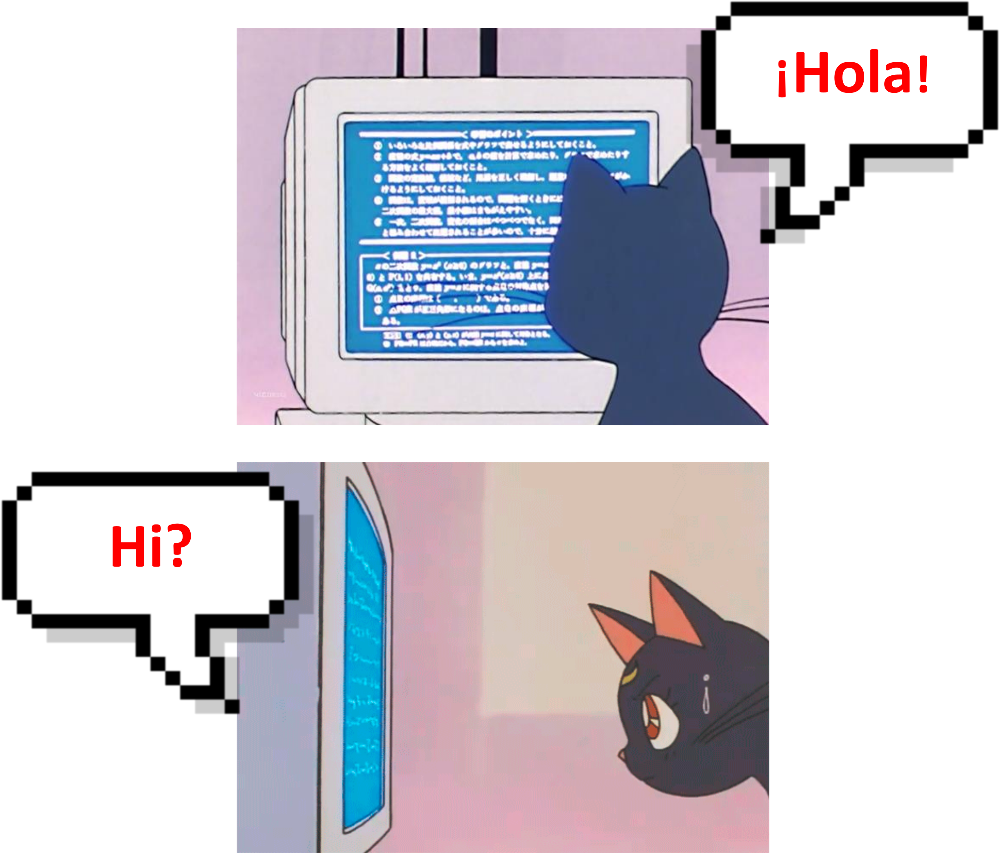]

<!--
Antes de comenzar la clase, me gustaría decir esto: la programación no es más que una forma de comunicarse con nuestra computadora. Las computadoras, como nosotres, se comunican "por escrito" y los lenguajes de programación son el medio para comunicarse con ellas.
-->

---
## Introducción

.center[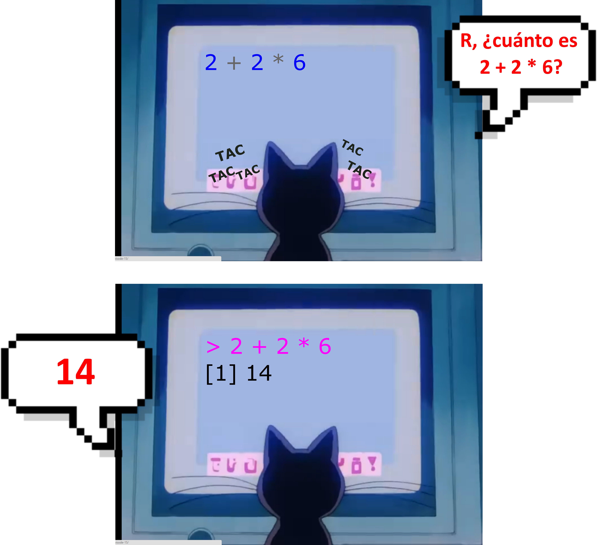]

<!--
Por ejemplo, podemos pedirle a la computadora que calcule una función simple escribiendo y ejecutando código en el lenguaje R.

Esta información me ayudó a no tener miedo de programar. Aprender un lenguaje de programación es como aprender cualquier idioma, como español o portugués.
(:
-->

---
## Introducción

.center[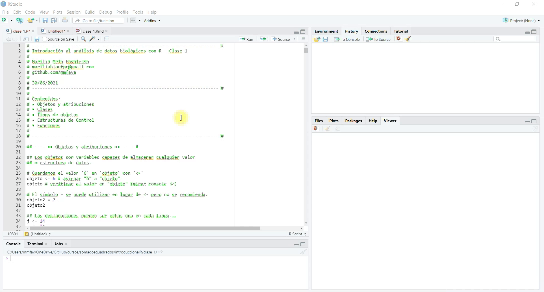

[`clase_1.R`](clase_1.R)
]

<!--
El script de esta clase está disponible en el sitio web del curso (lo dejaré en la descripción del video).

Todo lo que les voy a mostrar se describe en este script.
-->

---
## Introducción
### En nuestras diapositivas

<br>
.center[]

<!--
También quiero aclararle lo siguiente, en caso de duda: Las áreas grises en las diapositivas corresponden a los códigos R. Debajo de esta área, después de los símbolos "hash", veremos la salida de este código.
-->
---
## Introducción

### ¿Script mal configurado?

<button type="button">Tools</button> **>** <button type="button">Global options</button> **>** <button type="button">Code</button> **>** <button type="button">Saving</button> **>** <button type="button">Default text enconding</button> **>** select **UTF-8**

.center[]

<!--
Si abre el script y ve que los acentos no se muestran correctamente o alguna otra configuración incorrecta, intente cambiar la codificación a UTF-8.
-->

---
## Introducción

### Sistema de puntuación

<br>
.center[]
<br>

<!--
Otro dato importante es que R, a diferencia de nosotres, usa el punto como separador decimal y la coma como separador de miles. Es sumamente importante ser consciente de este hecho para que no obtengamos resultados incorrectos.
-->

---
# Script

- [`clase_1.R`](clase_1.R)

# Contenido de hoy

- [Objetos y atribuciones](#objatr)

- [Clases](#clases)

- [Tipos de objetos](#tipos)

- [Manejo de dados](#manejo)

- [Funciones](#funciones)

- [Paquetes](#paquetes)

<!--
En esta clase veremos los siguientes contenidos: Objetivos y asignaciones, clases, tipos de objetos, estructura de control y funciones.
-->

---
name: objatr
class: middle, center

# Objetos y atribuciones

<!--
Comenzando con objetos y asignaciones
-->

---
## Objetos y atribuciones

- Los **objetos** son variables capazes de almacenar cualquier valor o estructura de datos.

<br>
.center[]
<br>

```{r}
objeto <- 6 # Guardamos el valor '6' en 'objeto' con '<-'
objeto # Siempre que evaluamos el `objeto`, la R devolverá el valor 6
```

> El símbolo **`=`** se puede utilizar en lugar de **`<-`** pero no se recomienda. 

<!--
Los objetos son variables capazes de almacenar cualquier valor o estructura de datos.

Vamos tener un valor asignado - en el ejemplo es el valor 6 -, un operador de asignação - signo menor y guion - y el nombre del objeto - que en nuestro caso es "objeto". 

Al asignar el valor 6 al nombre "objeto", siempre que escribamos "objeto" seguido de CTRL + ENTER, la R devolverá el valor asignado.

También podemos utilizar el "igual" como símbolo de asignación, pero como escapa a las normas de una buena programación con R, se desaconseja su uso.
-->

---
## Objetos y atribuciones

Podemos almacenar el valor de un objeto `k` dentro de un objeto `w`:

.pull-left[
```{r}
k <- 10
k
```
]

.pull-right[
```{r}
w <- k
w
```

]
Podemos usar objetos para realizar operaciones matemáticas...

```{r}
(k + w) / 2
```

... y podemos asignar esta operación matemática a un nuevo objeto.

```{r}
j <- (k + w) / 2
j
```

<!--
Otra característica importante de los objetos es que podemos almacenar el valor de un objeto en otro.

Por ejemplo, si le asigno el valor 10 al objeto k, y luego le asigno el objeto k al nombre w, w se convierte en 10.

También podemos usar estos objetos en operaciones matemáticas y asignar esas operaciones matemáticas a un nuevo objeto.
-->
---
## Objetos y atribuciones

**¡¡**Cada objeto solo puede almacenar una estructura a la vez (un número o una secuencia de valores)**!!**

```{r}
a <- 5
a
```

```{r}
a <- 18
a
```

```{r}
a <- 36
a
```

<!--
También es importante tener en cuenta que los objetos solo pueden almacenar una estructura de valor a la vez.

Suponga que inicialmente establecemos el valor "5" para un objeto llamado "a". Cuando llamo "a" en R, R devolverá el valor 5, cierto?

Si en un segundo momento asigno la palabra "bien" al objeto "a", cuando llamo a este objeto R devolverá la palabra "bien" y no el valor 5, ¿se entiende?

Es como si hubiera sustituido un valor por otro ... En este caso, el último valor asignado siempre será el valor válido!!

¡Esto es muy, muy importante! Siempre tenemos que estar atentos para no cometer errores al utilizar R.
-->

---
## Reglas para nombrar objetos

1. Pueden estar formados por *letras*, *números*, "*_*" y "*.*"

2. **No** se puede empezar con un número y/o un punto

3. **No** puede contener espacios

4. Evitar el uso de acentos

5. Evitar el uso de nombres de funciones como:

  > sum, diff, df, var, pt, data, C, etc

6. La **R** distingue entre mayúsculas y minúsculas, por lo que:

  > obj ≠ Obj ≠ OBJ

.pull-left[
```{r}
obj <- 2; obj
```
]

.pull-right[
```{r}
OBJ <- 3; OBJ
```
]

<!--
Existen algunas reglas para nombrar objetos en R.

1. El nombre de los objetos pueden estar formados por *letras*, *números*, underline y punto.

2. **No** se puede empezar con un número y/o un punto

3. **No** puede contener espacios

4. Evitar el uso de acentos

5. Evitar el uso de nombres de funciones como:

  > sum, diff, df, var, pt, data, C, etc

6. La **R** distingue entre mayúsculas y minúsculas, por lo que:

  > obj ≠ Obj ≠ OBJ 
-->

---
## Reglas para nombrar objetos

#### Permitido

```{r eval=FALSE, include=TRUE}
a <- 5
a1 <- 5
obj <- 10
mi_obj <- 15
mi.obj <-15
```

#### No permitido

```{r eval=FALSE, include=TRUE}
1a <- 1
a 1 <- 5
_obj <-15
mi-obj <- 15
```


---
## Gestionar el lugar de trabajo

#### Observación:

La pestaña "**Environmental**" de RStudio muestra los objetos creados en la sesión actual.

<center>

</center>

---
## Gestionar el lugar de trabajo

Para eliminar objetos: `rm()`:
```{r eval=TRUE, message=FALSE, warning=FALSE, include=TRUE}
rm(a, k) # elimina los objetos a y k
ls() # ¿Qué objetos quedan?
```

<!--
Para saber qué objetos tengo en mi entorno r, simplemente use la función "ls()".

y para eliminar algun objeto, use la función "rm()" con el nombre del objeto entre los parentesis. 
-->
---
name: clases
class: middle, center

# Clases 

---
## Clases y tipos de objetos

Los `objetos` tienen tres características:

> <big> a <- 1</big>

1. **Nombre** que le damos al objeto (= a)

2. **Contenido** en sí del objeto (= 1)

3. **Atributo** del objeto

  - `Clase`: naturaleza del elementos (1 = numerico)
  - `Estructura`: Cómo están organizados los elementos (a = vector)

<!--
Creé un objeto en R llamado "A".

Este objeto tiene:

- un nombre = a
- un contenido = b
- y sus atributos.

Los atributos se pueden dividir en "clase" (que es la naturaleza del elemento) y "estructura" (cómo se organizan los elementos).

Veremos a ambos en la continuación. 
-->

---
## Clases de objetos

La clase de un objeto es muy importante en **R**! Es a partir de ella que las funciones y los operadores pueden saber *exactamente* qué hacer con un objeto. 

--

Por ejemplo, es posible sumar dos objetos numéricos,...

```{r}
a <- 1
b <- 2
a + b
```

--

... pero no podemos sumar dos caracteres:
```{r eval=FALSE, include=TRUE}
c <- "c"
d <- "!"
c + d
```

\## simpleError in "c" + "d": argumento no numérico para el operador binario.

> **R** verificó la naturaleza de "c" y "d" y las identificó como no numéricas.

---
## Clases de objetos

### Objetos atómicos

**R** tiene 5 clases básicas de objetos, también llamados **objetos atómicos**:

.pull-left[
1 - `numeric`: Números reales, punto flotante (decimales).
```{r}
num <- 1.50
```

2 - `integer`: Números enteros (poner un L al final)
```{r}
num_int <- 1L
```

3 - `logical`: booleano (True/False).
```{r}
logt <- TRUE
logf <- FALSE
```
]

.pull-right[
4 -  `character`: una cadena de caracteres, comúnmente utilizada para representar palabras, frases o texto. Poner entre comillas simple o doble. 
```{r}
ca <- "holla!"
cb <- 'todo bien??'
```

5 - `complex`: Un número con partes reales e imaginarias.
```{r}
com <- 1.5 + 2i
```
]

---
## Tipos de objetos

### Conversión 

- Es posible intentar forzar a un objeto a tener una clase específica:

.pull-left[
```{r}
a <- 1; a
```
]

.pull-right[
```{r}
class(a)
```

]

---------------------------------------------

.pull-left[
```{r eval=TRUE, message=FALSE, warning=FALSE, include=TRUE}
a1 <- as.character(a) 
class(a1)

a2 <- as.integer(a)
class(a2)
```
]

.pull-right[
```{r}
a3 <- as.numeric(a)
class(a3)

a4 <- as.logical(a)
class(a4)
```
]
---
name: tipos
class: middle, center

# Tipos de objetos

---
## Tipos de objetos

.pull-left[
- El tipo del objeto está relacionado con la **clase** y la **estructura/organización**.

- Pueden estar formados por elementos de la misma clase o de clases diferentes.

- Pueden tener de una hasta n dimensiones.

- En **R** tenemos cinco estructuras:
  - `Vector`
  - `Matrix`
  - `Array`
  - `List`
  - `Data frame`
]

.pull-right[

</small>
]

---
## Tipos de objetos

.pull-left[
- El tipo del objeto está relacionado con la **clase** y la **estructura/organización**.

- Pueden estar formados por elementos de la misma clase o de clases diferentes.

- Pueden tener de una hasta n dimensiones.

- En **R** tenemos cinco estructuras:
  - `Vector`
  - `Matrix`
  - `Array`
  - `List`
  - `Data frame`
]

.pull-right[
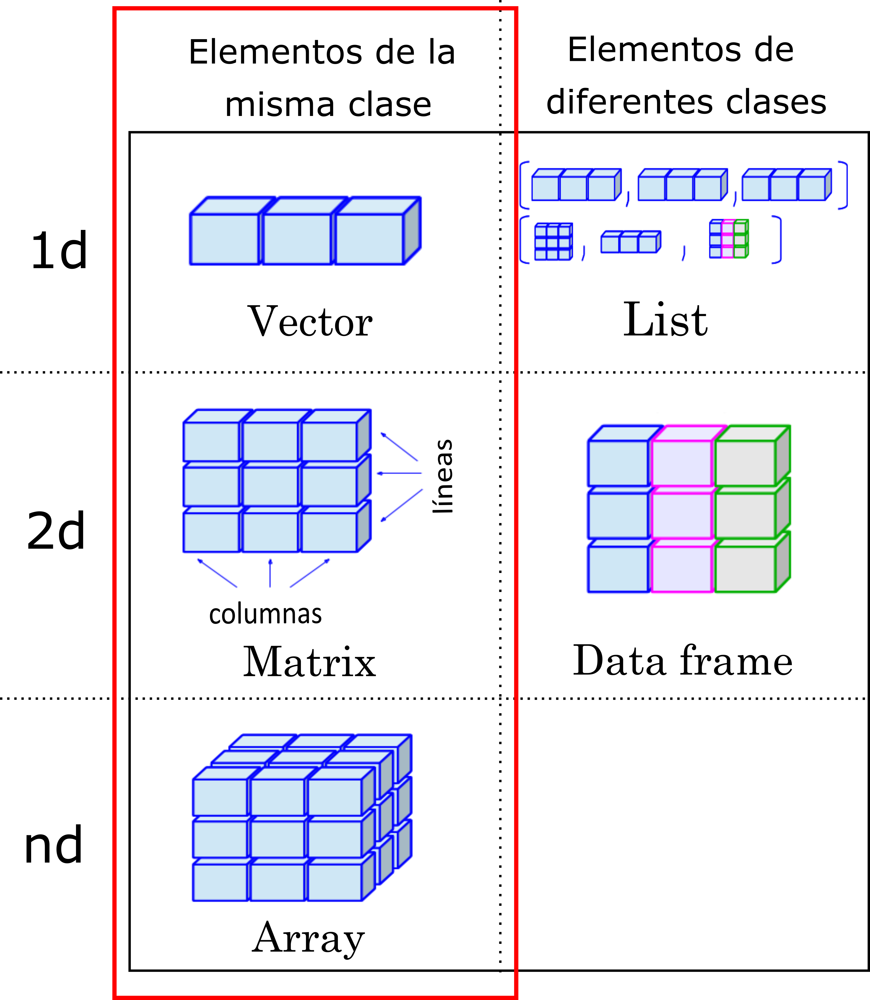
</small>
]

---
## Tipos de objetos

### Vetores

- Colección **unidimensional** de valores:

.center[]

- Almacena datos de una misma clase.

- La forma más sencilla de crear un `vector` es enumerar los valores separados por comas dentro de una `c()`:

.pull-left[
```{r}
area <- c("urb", "rur", "urb", "rur", "urb", "rur")
area
```
]

.pull-right[
```{r}
temperatura <- c(20, 23, 18, 20, 14, 17)
temperatura
```

]

---
## Tipos de objetos

### Vetores

#### Coerción

- No es posible mezclar datos de dos clases en un vector.

- Si lo intenta, **R** exhibirá el comportamiento conocido como **coerción**.

```{r}
aa <- c(1, 2, 3, 4, "a")
class(aa)

bb <- c(1L, 2L, 3.50, 4.1)
class(bb)
```

> **DOMINANTE** character > numeric > integer > logical **RECESIVO**

---
## Tipos de objetos

### Factor

- Colección **unidimensional** de valores.

- Almacena datos de la clase `character`.

- El factor representa medidas de una variable *cualitativa*, que puede ser *nominal* u *ordinal*.

```{r}
estacion <- c("verano", "verano", "primavera", "primavera", "primavera", "otono", "invierno",  "invierno")

as.factor(estacion)
```

<!--
Los factores corresponden a una colección unidimensional de valores de la clase "character".

Los factores se utilizan para representar variables categóricas. Las variables categóricas pueden ser nominales (desordenadas) u ordinales (ordenadas).

Los objetos de tipo factor se crean utilizando la función factor() en R. Los posibles valores de un objeto de tipo factor se denominan niveles (levels).

De esta manera, un factor contendrá un vector de valores y sus valores representan niveles.

Por ejemplo, puedo tener un factor que represente las veces que he muestreado en el campo. En este caso, realicé dos muestreos en "verano", tres en "primavera", uno en "otoño" y uno en "invierno".

Como estamos trabajando con factores, R entenderá que valores iguales a "verano" se refieren al mismo nivel que mi factor.
-->

---
## Tipos de objetos

### Matrix

- Colección **bidimensional** de valores:

  - líneas (por ejemplo, unidades de muestreo)
  
  - columnas (variables cuantitativas o cualitativas, por ejemplo: horario, tubo de ensayo, ubicación)
  
- Almacena datos de una única clase.

.center[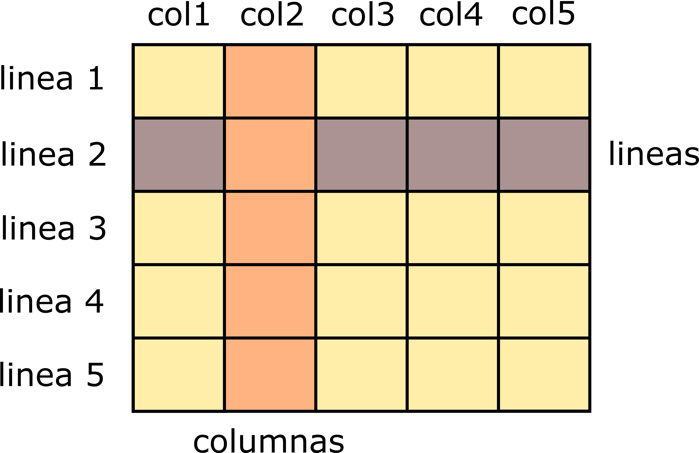]

---
## Tipos de objetos

### Matrix

- Colección **bidimensional** de valores:

  - líneas (por ejemplo, unidades de muestreo)
  
  - columnas (variables cuantitativas o cualitativas, por ejemplo: horario, tubo de ensayo, ubicación)
  
- Almacena datos de una única clase.

.center[]

.center[Volume respiratório forzado (vez)]

---
## Tipos de objetos

### Matrix

Para construir matrices en **R**:

Combinación de vectores: 

```{r}
# Creamos dos vectores con r
v1 <- c(1, 2, 3); v2 <- c(4, 5, 6)
```


.pull-left[
- Combinar vectores por línea - `rbind()`.

```{r}
# Combinamos los vectores verticalmente, 
# uno debajo del otro
vr <- rbind(v1, v2)
vr
```

]

.pull-right[
- Combinar vectores por columna - `cbind()`.

```{r}
# Combinamos los vectores horizontalmente, 
# uno al lado del otro.
vr <- cbind(v1, v2)
vr
```
]

---
## Tipos de objetos

### Array

- Tiene **n dimensiones** - "varias matrices emparejadas".

- Tiene filas, columnas y dimensiones (`arrays`).

- Almacena datos de una única clase.

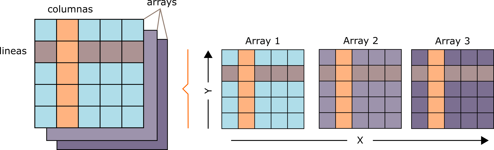

---
## Tipos de objetos

### Array

Construir un array en **R**: `array()`.

```{r}
vc <- 1:8; vc # datos

ar <- array(data = vc, dim = c(2, 2, 2)) # array
ar
```

---
## Tipos de objetos

.pull-left[
- El tipo del objeto está relacionado con la **clase** y la **estructura/organización**.

- Pueden estar formados por elementos de la misma clase o de clases diferentes.

- Pueden tener de una hasta n dimensiones.

- En **R** tenemos cinco estructuras:
  - `Vector`
  - `Matrix`
  - `Array`
  - `List`
  - `Data frame`
]

.pull-right[
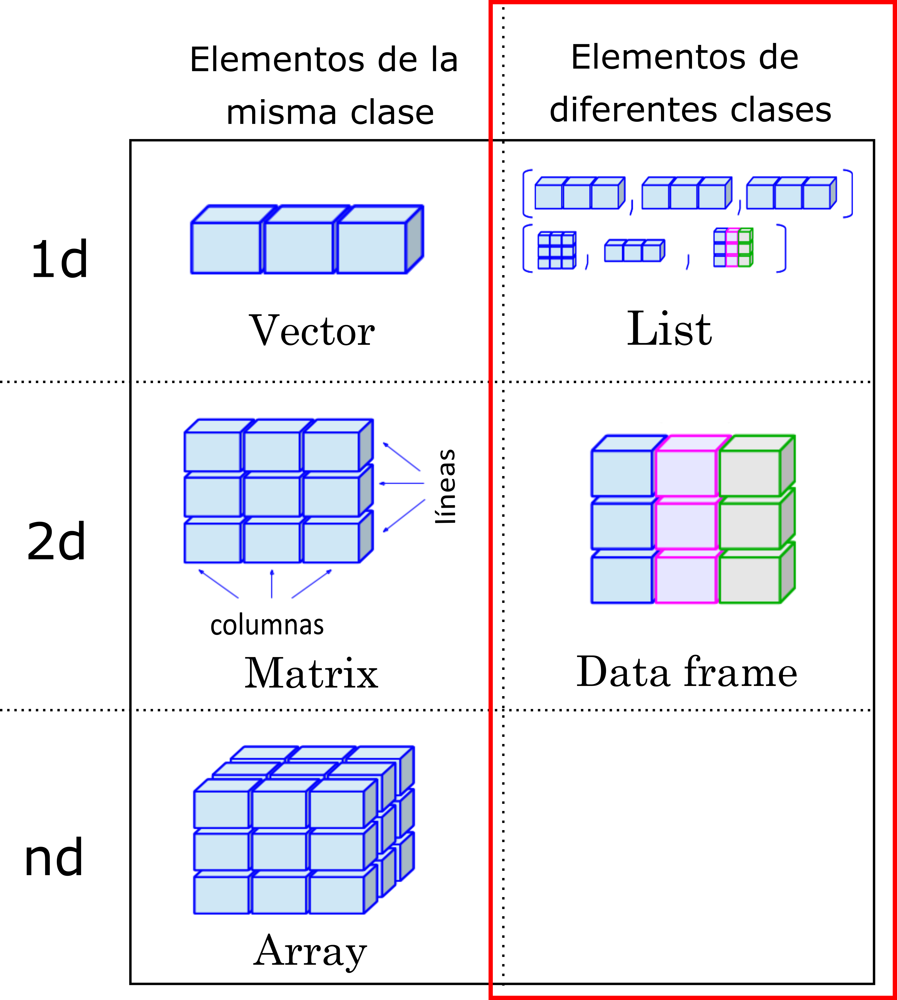
]

---
## Tipos de objetos

### Data frame

- Colección **bidimensional** de valores:

  - líneas (unidades de muestreo)
  
  - columnas (variables cuantitativas o cualitativas, por ejemplo: horario, tubo de ensayo, ubicación)
  
- Almacena datos de ≠ clases.

.pull-left[]

--

.pull-right[
<br>
]

---
## Tipos de objetos

### Data frame

Cómo construir un **data frame** en **R**: `data.frame()`. 


---
## Tipos de objetos

### Data frame

Cómo construir un **data frame** en **R**: `data.frame()`. 

.pull-left[
```{r}
# Vamos a crear 4 vectores
area <- c("urb", "rur", "urb", "rur", "urb", "rur")
mes <- c(1, 1, 2, 2, 3, 3)
presencia <- c(T, T, F, F, T, T)
temperatura <- c(20.1, 21.2, 22.2, 23.8, 22.9, 23)

area; mes; presencia; temperatura
```
]

--

.pull-right[
```{r}
# Unamos los vetores en un dataframe. 
# Observe que cada vector se convierte en una columna.
dtf <- data.frame(area, mes, presencia, temperatura)
dtf
```
]

---
## Tipos de objetos

### List

- Colección **unidimensional** de objetos.
  
- Almacena datos de ≠ tipos (`vectors`, `arrays`, `data frame`, `lists`).

- Es un vector especial que acepta objetos como elementos.
  
> Muchas funciones que usamos para analizar datos en R tienen listas como salida.


---
## Tipos de objetos

### List

crea una **lista** en r: `list()`.

```{r}
lis <- list(vr,  
            temperatura,
            factor(c("a", "a", "b", "c")))
lis
```


---
name: manejo
class: middle, center

# Manejo de datos

---
## Manejo de datos

.pull-left[
- Los objetos son conjuntos *indexados* - Esto nos permite acceder a cada elemento de manera individual.

- Comprender la indexación es fundamental para manipular datos en **R**.

- Usamos corchetes (`[]`) para acceder a la posición de los elementos de un objeto: 
  - **[L, C, D]**.
]

.pull-right[]

<!--
Una vez que hemos aprendido a crear objetos en R, es hora de que aprendamos a manipularlos.

Los objetos son conjuntos *indexados* de valores, o sea, es posible acceder a cada elemento de un objeto de manera individual.

La indexación es como una etiquetas, y desde estas etiquetas es posible reconocer y seleccionar los elementos del objeto. 

En R usamos corchetes para acceder a la posición del elemento que nos interesa y la cantidad de elementos presentes en los corchetes dependerá de la cantidad de dimensiones que tendremos en nuestros objetos.

-->

---
## Manejo de datos

### Indexación

#### Gestión de datos unidimensionales `[L]`

- Seleccionar elementos

.center[]

- No **R**:

```{r}
ve <- c(11, 12, 13, 14, 15, 16)
ve
```

---
## Manejo de datos

### Indexación

#### Gestión de datos unidimensionales `[L]`

- Seleccionar elementos

.center[]

- No **R**:

```{r}
ve <- c(11, 12, 13, 14, 15, 16)
ve
```

.pull-left[
```{r}
ve[3]
```
]

.pull-right[
```{r}
ve[2:4]
```
]

<!--
Comencemos seleccionando elementos en un objeto unidimensional.

¿Recuerdas los vectores que vimos en la última clase? Los vectores son objetos unidimensionales que almacenan elementos de una misma clase.

Aquí tenemos el vector VE como ejemplo. Este vector contiene valores entre 11 y 16, y podemos ver debajo de él que cada valor tiene una posición dentro del vector.

Cada posición tiene un valor que viene dado por el orden en que se agregó los valores al objeto.

De esa forma, si quiero acceder al primer elemento (o la primera posición) de mi vector, debo escribir el nombre de mi objeto y, entre corchetes, el número "1". Cuando ejecuto esta función, R devuelve el número que se almacenó en la posición 1 de mi vector VE.
--> 

---
## Manejo de datos

### Indexación

#### Gestión de datos unidimensionales `[L]`

- Quitar elementos

.center[]

- No **R**:

```{r}
ve <- c(11, 12, 13, 14, 15, 16)
ve
```

.pull-left[
```{r}
ve[-1]
```
]

.pull-right[
```{r}
ve[-c(2, 5)]
```
]
---
## Manejo de datos

### Indexación

#### Gestión de datos bidimensionales `[L,C]`

- Seleccionar elementos

.center[

]

---
## Manejo de datos

### Indexación

#### Gestión de datos bidimensionales `[L,C]`

- Seleccionar elementos

```{r}
ma <- matrix(data = (c(1:25)), nrow = 5, ncol = 5, byrow = TRUE) # crear una matriz
ma

ma[1,2] # seleccionar el valor de la línea uno y la segunda columna.
```

---
## Manejo de datos

### Indexación

#### Gestión de datos bidimensionales `[L,C]`

- Seleccionar elementos

```{r}
ma[3:4, c(3, 5)] # seleccione las lineas 3 y 4 y las columnas 3 y 5

ma[c(1,5), 3:5] # seleccione las lineas 1 y 5 y las columnas entre 3 - 5
```

> Es posible seleccionar más de una fila y columna al mismo tiempo.

---
## Manejo de datos

### Indexación

#### Gestión de datos bidimensionales `[L,C]`

- Quitar elementos

.pull-left[
**Antes**
```{r}
ma
```
]

.pull-right[
**Después**
```{r}
ma[-2, -2] # menos la fila dos y la columna dos
```
]

---
## Manejo de datos

### Indexación

#### Gestión de datos bidimensionales `[L,C]`

- Quitar elementos

.pull-left[
**Antes**
```{r}
ma
```
]

.pull-right[
**Después**
```{r}
ma[-2:-3, -c(1,5)] 
```
]

---
## Manejo de datos

### Indexación

#### Gestión de datos bidimensionales `[L,C]`

- También podemos usar el nombre de las filas y columnas para manejar los datos: `[nombre_linea, nombre_columna]`.

```{r}
rownames(ma) <- c("l1", "l2", "l3", "l4", "l5") # nombre en las lineas
colnames(ma) <- c("c1", "c2", "c3", "c4", "c5") # nombre en las columnas
ma # la tabla

ma["l1", "c2"] # selecciona linea 2 y columna 3
```

---
## Manejo de datos

### Indexación

#### Gestión de *data frame* `$`:

> El operador `$` se utiliza para extraer elementos de una columna com nombre:

```{r}
mb <- data.frame(ma)
class(mb)

mb$c1 # columna 1

mb$c2 # columna 2
```

---
## Manejo de datos

### Indexación

#### Gestión de *data frame* con `$`:

- agregar una nueva columna:

```{r}
# después
mb$ID <- 1:5
mb
```

---
## Manejo de datos

### Seleccionar elementos por condición (**vector**)

<br>
.center[]
<br>

> Operadores relacionales con salidas** booleanas** (VERDADERO o FALSO). 

---
## Manejo de datos

### Seleccionar elementos por condición (**vector**)

<br>
.center[]

> Comparación de objetos: **A** *con* **B**. <br>
> Operadores relacionales con salidas** booleanas** (VERDADERO o FALSO). 

---
## Manejo de datos

### Seleccionar elementos por condición (**vector**)

- Operadores relacionales con salidas booleanas (VERDADERO o FALSO). 
```{r}
A <- 6; B <- 28
```

.pull-left[
```{r}
A == B # A es igual a B?
A != B # A es distinto de B?
A > B # A es mayor que B?
```
]

.pull-right[
```{r}
A <= B # A menor o igual que?
A < B # A es menor que B?
A %in% B # A en B?
```
]

---
## Manejo de datos

### Seleccionar elementos por condición (**vector**)

- Operadores relacionales con salidas **booleanas** (VERDADERO o FALSO). 
```{r}
ve <- c(10, 15, 30, 32, 50, 68, 70)
ve
```

.pull-left[
```{r}
# ¿Qué elementos tienen el valor = 30?
ve == 30 

# ¿Qué elementos tienen un valor superior a 30?
ve > 30
```
]

.pull-right[
```{r}
# ¿Qué elementos tienen el valor inferior a 50?
ve < 50

# ¿Qué elementos tienen valores mayores o iguales a 45?
ve >= 45
```
]

---
## Manejo de datos

### Seleccionar elementos por condición (**vector**)

- Elementos del vector

  - ¿Qué pasa si, en lugar de querer saber cuál valor coincide con la condición y cuál no, quisiera seleccionar los valores relacionados con esa condición?

<br>
.center[]

.pull-left[
```{r}
# Antes:
ve < 30
```
]

.pull-right[
```{r}
# Después:
ve[ve < 30]
```
]

---
## Manejo de datos

### Seleccionar elementos por condición (**vector**)

- Elementos del vector

.pull-left[
```{r}
# ¿Qué valor/es es igual a 30?
ve[ve == 30]

# ¿Qué valor/es valen menos de 50?
ve[ve < 50]

# ¿ve esta inserido en el conjunto 32?
ve[ve %in% 32]
```
]

.pull-right[
```{r}
# ¿Qué valor/es es/son superior/es a 30?
ve[ve > 30]

# ¿Qué valor/es es/son mayores o iguales a 45?
ve[ve >= 45]

# ¿Qué valor/es es/son distintos de 10?
ve[ve != 10]
```
]

---
## Manejo de datos

### Seleccionar elementos por condición (**matrix/data.frame**)

<br>
.center[]
<br>

> Operadores relacionales con salidas** booleanas** (VERDADERO o FALSO). 

---
## Manejo de datos

### Seleccionar elementos por condición (**matrix/data.frame**)

- Operadores relacionales con salidas **booleanas** (VERDADERO o FALSO). 
```{r}
ma <- matrix(c(1:12), nrow = 3)
ma
```

.pull-left[
```{r}
# ¿Qué elementos tienen los valores
# = 5 o 6?
ma == c(5, 6)
```
]

.pull-right[
```{r}
# ¿Qué elementos tienen el valor 
# inferior a 8?
ma < 8
```
]

---
## Manejo de datos

### Seleccionar elementos por condición (**matrix/data.frame**)

- Elementos de la **matrix/data.frame**.

  - ¿Qué pasa si, en lugar de querer saber cuál valor coincide con la condición y cuál no, quisiera seleccionar los valores relacionados con esa condición?

<br>
.center[]
<br>

```{r}
ma[ma == 8]
```

---
## Manejo de datos

### Seleccionar elementos por condición (**matrix/data.frame**)

- Operadores relacionales con salidas **booleanas** (VERDADERO o FALSO). 

```{r}
# ¿La matriz contiene los valores 5, 7 y 15?
ma[ma == c(5, 7, 15)]

# ¿Está la matriz contenida en c(0, 2, 6, 18)?
ma[ma %in% c(0, 2, 6, 18)]

# ¿La matriz es diferente de 5?
ma[ma != 5]
```

---
## Manejo de datos

### Seleccionar elementos por condición (**data.frame**)


<br>
.center[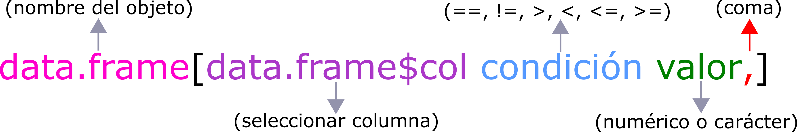]
<br>


- Podemos usar `$` y `selección por condición` para seleccionar solo las filas de un **data.frame** que coinciden con una condición. 

---
## Manejo de datos

### Seleccionar elementos por condición (**data.frame**)

.pull-left[
```{r}
edad <- c(20, 25, 30, 45)
sexo <- c("F", "F", "M", "M")
enfermedad <- c(T, T, F, F)

datos <- data.frame(edad, sexo, enfermedad)
datos
```
.center[]

]

.pull-right[
```{r}
datos[datos$edad <= 30,] 

datos[datos$sexo == "F",] 

datos[datos$enfermedad == T,] 

```
]

---
name: funciones
class: middle, center

# Funciones

---
## Funciones

- Mientras que los **objetos** son *nombres que contienen valores*, las **funciones** son *nombres que contienen un código R*.

.center[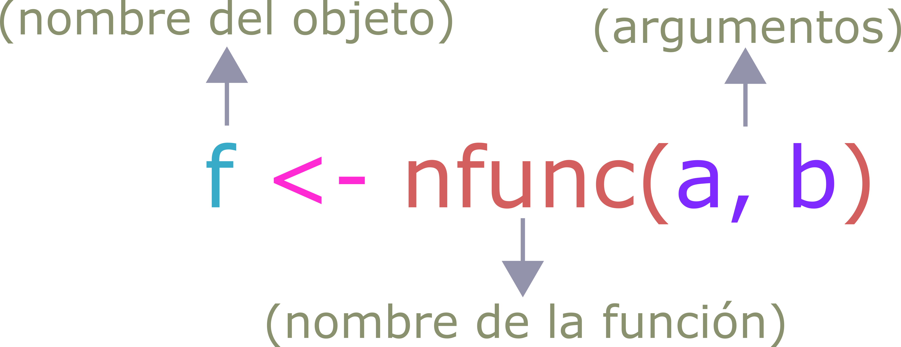]

-  La idea básica de una función es encapsular un código que se pueda invocar en cualquier momento en R. 
<br>

<br>
.center[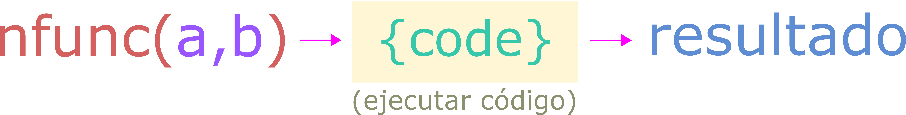]

> Usamos algunas funciones hasta ahora: `c()`, `rep()`, `data.frame()`, `class()`, otros.

---
## Funciones

### Argumentos

- Las funciones toman **argumentos**.

- Los argumentos son los valores u objetos que ponemos entre paréntesis y que las funciones necesitan para funcional (calculando un resultado).

- Por ejemplo, la función `class()` necesita recibir un objeto para investigar la clase y devolverlo:

```{r}
a <- 3
class(a)
```

> En este caso, "a" es el argumento que incluimos en la función `class()`.

---
## Funciones

### Argumentos

- Para las funciones que toman más de un argumento, tenemos que separar los argumentos con comas.

- Por ejemplo, cuando usamos la concatenación (`c()`) para crear un **vector**.

```{r}
ve <- c(1, 2, 3, 4)
```

--
**Importante:**

**!!** Observe cómo debe ser la entrada de valores para que funcione la función.

```{r eval=FALSE, include=TRUE}
class(1, 2, 3, 4)
```
<small> \# simpleError in class(1, 2, 3, 4): 4 argumentos passados para 'class', que requer 1 </small>

```{r}
class(ve)
```

---
## Funciones

### Argumentos

Los argumentos de las funciónes también tienen **nombre**, que pueden o no ser usando en la función. Por ejemplo a función `rep()`.

```{r}
rep(x = c(1, 3), 
    times = 2) 
```

- **x**: valores que se repetirán.
- **times**: Un vector de valor entero que da el número (no negativo) de veces que se repite cada elemento si tiene una longitud (x), o que se repite todo el vector si tiene una longitud 1.

---
## Funciones

- **¿**Existe una función lista para mi problema**?**

- **¿**Cómo averiguar el nombre de esta función**?**

.center[]

---
name: paquetes
class: middle, center

# Paquetes

---
## Paquetes

- Las funciones provienen de dos fuentes: 
  1. paquetes **R** estándar que se cargan siempre que trabajamos con el lenguaje 
  2. paquetes que instalamos y cargamos por comandos.

- Básicamente, un paquete es una convención para organizar y estandarizar la distribución de funciones **R**.

<br>
.center[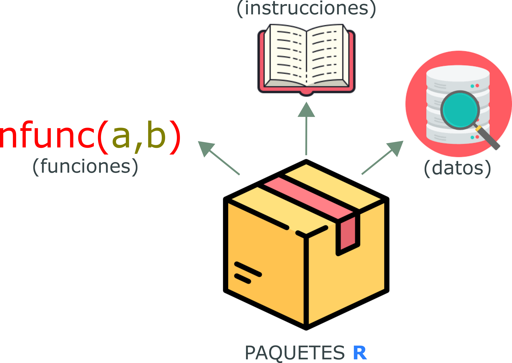]

---
## Paquetes

- La principal motivación de crear un paquete **R** es de organizar y compartir funciones de nuevos métodos y/o implementaciones creadas y que son útiles para otras personas.

- En general, descargamos paquetes de dos fuentes: [CRAN](https://cran.r-project.org/) y [GitHub](https://github.com/). 

<br>
.center[]

---
## Paquetes

### Instalación

- Para instalar paquetes desde **CRAN** usamos el comando `install.packages("nombre_paquete")`.

```{r eval=FALSE, include=TRUE}
install.packages("ggplot2") # Para instalar el paquete "ggplot2"
```

> **\*** Tenga en cuenta que el nombre del paquete siempre debe ir entre comillas para la instalación.

<br>
- Compruebe si el paquete se ha instalado:

.pull-left[
```{r eval=FALSE, include=TRUE}
library()
```
> abre una nueva pestaña en R escrita "Paquetes R disponibles".

]
.pull-right[]


---
## Paquetes

### Instalación

- Para instalar paquetes de **Github**, usamos el paquete `devtools`: `install_github("direccion/nombre_paquete")`.

- Para hacer esto, necesitaremos la dirección y el nombre del paquete de un repositorio de GitHub (<https://github.com/tidyverse/dplyr>)

```{r eval=FALSE, include=T}
# Instalar el paquete 'devtools'
install.packages("devtools")

# Cargar el paquete para su uso
library(devtools)

# Incluir la dirección de descarga 
# del paquete do github en install_github()
install_github("tidyverse/dplyr")
```

---
## Paquetes

### Instalación

- Para instalar paquetes de **Github**, usamos el paquete `devtools`:

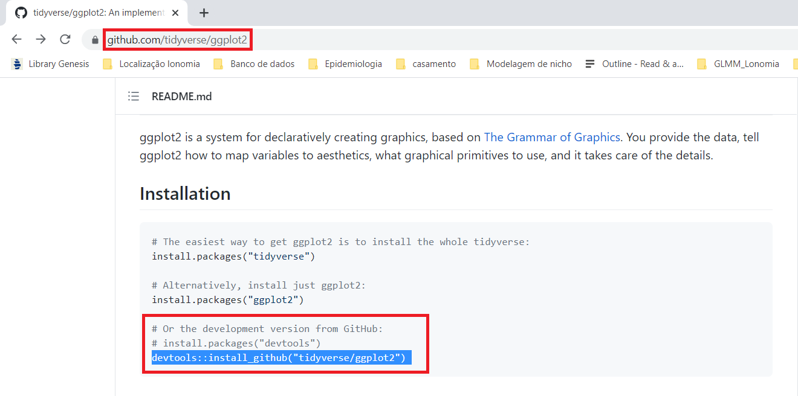

---
## Paquetes

### Instalación

- Solo instalamos los paquetes una vez.

- Los paquetes se descargan a través de la internet.

- El nombre del paquete debe estar entre comillas (`"paquete_nombre"`), independientemente de si lo vamos a descargar de **CRAN** o **GitHub**.

- Para cargar paquetes en R usamos la función `library(paquete_nombre`). 
  - En este caso no es necesario incluir comillas.
  - Cargamos paquetes para usar sus funciones. 

```{r eval=FALSE, include=TRUE}
library(ggplot2)
library(dplyr)
```

---
## Paquetes

### Actualización

- Los paquetes no se actualizan solos.

- Es necesario actualizarlos de vez en cuando.

- ¡Es un proceso que lleva tiempo!

```{r eval=FALSE, include=TRUE}
update.packages(ask = FALSE)
```

### Dirección en mi compu

- ¿Dónde están los paquetes?

  - Windows: `C:/Users/nombre_del_compu/Documentación/R/win-library/versión_r`
  - Unix (Linux o MacOS): `/home/nombre_del_compu/R/tipo_compu/versión_r`

---
## Paquetes

### Paquetes útil para empezar! (clase manana)

- **tidyverse** 
  - es una colección obstinada de paquetes R diseñados para la ciencia de datos. 

.center[]

---
## Paquetes

### Cantidad de paquetes disponibles
```{r}
nrow(available.packages(repos = "http://cran.r-project.org"))
```

.center[]

---
## Paquetes

### Help! (ayuda)

- El "help" de **R** es muy útil cuando necesitamos ayuda para comprender una función.

```{r eval=FALSE, include=TRUE}
help("sum") 
# es necesario encerrar el nombre de 
# la función entre comillas.
```

.center[]

---
## Paquetes

###  ¿Cómo citar la **R**?

```{r}
citation()
```

---
## Paquetes

###  ¿Cómo citar un paquete?

```{r}
citation("ggplot2")
```

---
class: middle, center

##  ¡Es todo por hoy!
### ¡Gracias por tu presencia!


---
## Si tenemos tiempo 🕗

### Resuelve los siguientes ejercicios

1. Cree un vector que contenga tres especies de mamíferos y guárdelo en un objeto.

2. Cree una matriz de datos con valores aleatorios entre 0 y 100 (tip: `sample()`). La matriz debe contener 3 filas y 4 columnas.

3. Nombra las líneas de tu matriz con el vector que creaste en el **ejercicio 1**. Las columnas deben contener el nombre de las estaciones.


4. Transforme su matriz en un data frame. 

5. ¿Qué especie fue más abundante en primavera? ¿Y cuál fue el menos abundante en invierno?

---
class: middle

<br> 

<br>

<br>

### Soma dos quadrados

- `r icons::icon_style(icons::fontawesome("github"), fill = "#000000")` [Soma-Dos-Quadrados/introduccionalR](https://github.com/Soma-dos-Quadrados/introduccionalR)
- `r icons::icon_style(icons::fontawesome("youtube"), fill = "#000000")` [/somaquadrados](https://www.youtube.com/channel/UC8_OHjnszxRiit92ZJlNH4A)
- `r icons::icon_style(icons::fontawesome("twitch"), fill = "#000000")` [/somadosquadrados](https://www.twitch.tv/somaquadrados)
- `r icons::icon_style(icons::fontawesome("twitter"), fill = "#000000")` [@somadosquadrados](https://twitter.com/somaquadrados)


### Marília Melo Favalesso 

- `r icons::icon_style(icons::fontawesome("envelope", style = "solid"), fill = "#000000")` [mariliabioufpr@gmail.com](mariliabioufpr@gmail.com)
- `r icons::icon_style(icons::fontawesome("globe-americas", style = "solid"), fill = "#000000")` [www.mmfava.com](www.mmfava.com)
- `r icons::icon_style(icons::fontawesome("github"), fill = "#000000")` [ /mmfava](https://github.com/mmfava)

