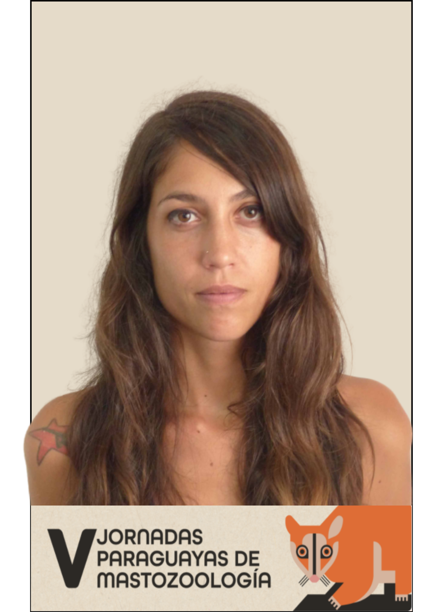
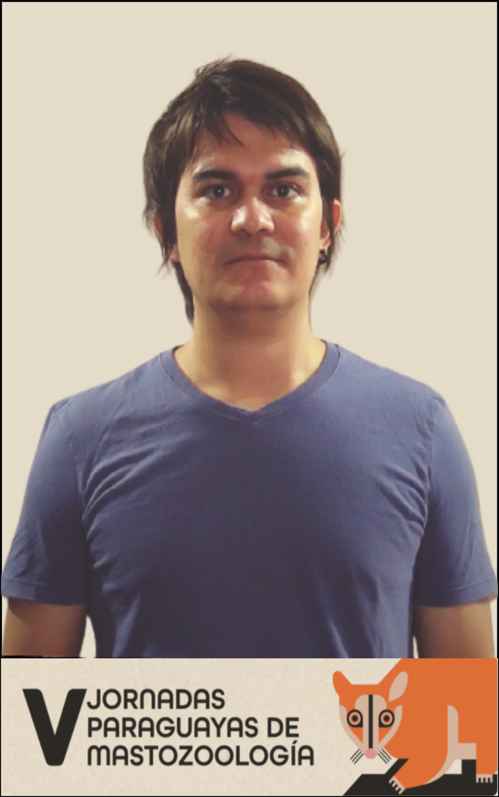
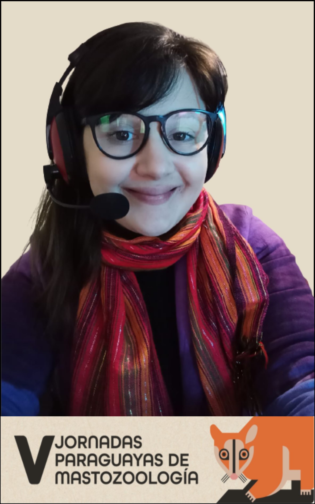

# Descripción

Este es un curso de una semana en programación R para analizar datos mastozoologícos. Se realiza de forma sincrónica, con ejercicios. Es un curso intensivo y desafiante que invita a los estudiantes a pensar y desarrollar algoritmos para el análisis de datos. Específicamente, el curso tiene como objetivo enseñar a los participantes a:

(a) desarrollar e interpretar scripts R

(b) importar y manipular datos

(c) describir y visualizar datos

Subiremos los videos de las clases al canal de youtube de [\@somaquadrados](https://www.youtube.com/channel/UC8_OHjnszxRiit92ZJlNH4A). Los videos se pueden ver de forma asincrónica. El material escrito, las diapositivas, los guiones y las tareas estarán disponibles en el post en la continuación. 

# Fechas
- Inicio: 18/10/2021
- Finaliza: 22/10/2021

# Profesores

## Daniela Lamattina

Veterinaria (UNCPBA, Argentina), Doctora en Cs. Veterinarias (UNL, Argentina), técnica profesional del Instituto Nacional de Medicina Tropical e Investigadora asistente de CONICET (Argentina). Empezó a incursionar en R en 2015, cuando inició sus estudios de posgrado

`r icons::icon_style(icons::fontawesome("envelope", style = "solid"), fill = "#000000")`[daniela.lamattina@gmail.com ](daniela.lamattina@gmail.com )

## Eliana Florencia Burgos

Bióloga (UADER - Argentina), estudiante de la especialización en Biología de la Conservación (UNaM - Argentina) y estudiante de Doctorado en Ecología, Genética y Evolución (UBA - Argentina). Trabaja con R desde 2018 cuando inició sus estudios de posgrado.

`r icons::icon_style(icons::fontawesome("envelope", style = "solid"), fill = "#000000")`[burgosef@gmail.com](burgosef@gmail.com )

## Julio Torres

Biólogo por la Universidad Nacional de Asunción (UNA). Doctor en Ciencias Naturales por la Universidad Nacional de la Plata (UNLP). Actualmente es Investigador asociado al Instituto de Investigación Biológica del Paraguay (IIBP) y consultor en relevamientos de mamíferos. Trabaja con el Lenguaje R desde 2017, aplicando esta herramienta en tareas de limpieza de datos, elaboración de gráficos y análisis con datos de morfometría geométrica.

`r icons::icon_style(icons::fontawesome("envelope", style = "solid"), fill = "#000000")`[juliomystorres@gmail.com ](juliomystorres@gmail.com)

## Marília Melo Favalesso

Bióloga (UFPR - Brasil), Magíster en Conservación y Manejo de Recursos Naturales (UNIOESTE - Brasil) y Estudiante de Doctorado en Ecología, Genética y Evolución (UBA - Argentina). Trabaja con R desde 2016 cuando realizaba labores de consultoría y asesoría en bioestadística.

`r icons::icon_style(icons::fontawesome("envelope", style = "solid"), fill = "#000000")`[mariliabioufpr@gmail.com](mariliabioufpr@gmail.com)

# Link de la reunión
Les dejamos aquí el link de la reunión que será el mismo a utilizar durante toda la semana:  [https://us02web.zoom.us/j/86944112348](https://us02web.zoom.us/j/86944112348 )       

-------------------------------------------------------------------------------

# Clases

## Clase 0 (hasta 16/10/2021)

1. Responda el cuestionario presente en [*Google Forms* (haga clic aquí)](https://docs.google.com/forms/d/e/1FAIpQLSdLulk1972mhuLnrvWqq2pc_onegCfJQAgi2Ne7ak_hzrJQWg/viewform).

2. Únase a nuestro grupo en el Telegrama: [https://t.me/R_VJPM](https://t.me/R_VJPM)

2. Ver video-clase 0: 

<iframe width="560" height="315" src="https://www.youtube.com/embed/avI8KI9rpII" title="YouTube video player" frameborder="0" allow="accelerometer; autoplay; clipboard-write; encrypted-media; gyroscope; picture-in-picture" allowfullscreen></iframe>

[https://youtu.be/avI8KI9rpII](https://youtu.be/avI8KI9rpII)

4. Instalar R: [https://cran.r-project.org/bin/windows/base/](https://cran.r-project.org/bin/windows/base/)

5. Instalar RStudio: [https://www.rstudio.com/products/rstudio/download/](https://www.rstudio.com/products/rstudio/download/)

*¿No puede instalar los programas a tiempo o ha tenido algún problema con la instalación? ¡Posibilidad de utilizar la el *RStudio cloud*!: [https://rstudio.cloud/](https://rstudio.cloud/ ) 

## Clase 1 (lunes - 18/10/2021)

### Slides
[Download en PDF](clases/c1/clase_1.pdf)

[Download en html](clases/c1/clase_1.html)

### Script
[Script Clase 1](clases/c1/clase_1.R)

## Clase 2 (martes - 19/10/2021)

### Slides
[Download en PDF](clases/c2/clase_2.pdf)

[Download en HTML](clases/c2/clase_2.html)

### Script
[Script Clase 2](clases/c2/clase_2.R)

### Archivos
[datos.csv](clases/c2/datos.csv)

[datos.txt](clases/c2/datos.txt)

[datos.xlsx](clases/c2/datos.xlsx)

[tidy_ej.xlsx](clases/c2/tidy_ej.xlsx)

## Clase 3 (miércoles - 20/10/2021)

### Parte I:

### Slides
[Download en PDF - Teorica](clases/c3/Clase31a.pdf)

[Download en PDF - Practica](clases/c3/Clase31b.pdf)

### Script
[Script Clase 3.1 - Teorica](clases/c3/Script31a.R)

[Script Clase 3.1 - Practica](clases/c3/Script31b.R)

### Archivos
[Ejercicio_7](clases/c3/Ejercicio_7.csv)

[Ejercicio_6](clases/c3/Ejercicio_6.csv)

[Cuicas](clases/c3/Cuicas.csv)

### Parte II:

### Slides

[Download en PDF 3.2 - Teorica](Clase32.pdf)

[Download en PPTX 3.2 - Teorica](Clase32.pptx)

### Script
[Script Clase 3.2 - Teorica](clases/c3/Script32.R)

### Archivos
[Frecuencias](clases/c3/tablasfrecuenciasDani.csv)

## Clase 4 (jueves - 21/10/2021)

### Slides

### Script

### Archivos

## Trabajo final (viernes - 22/10/2021)

### Script
[Script Clase 3.2 - Teorica](clases/tf/TF.R)

