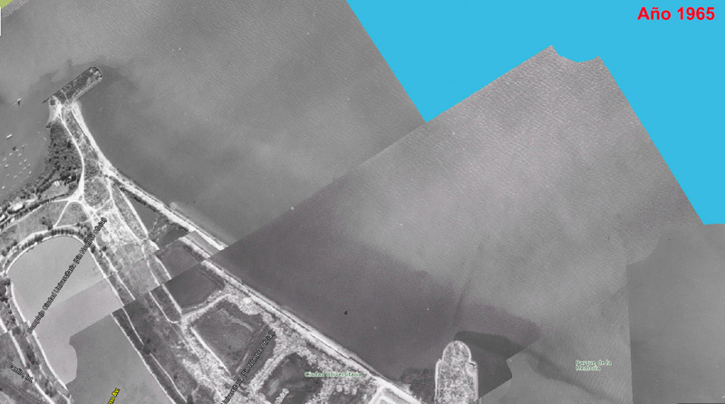
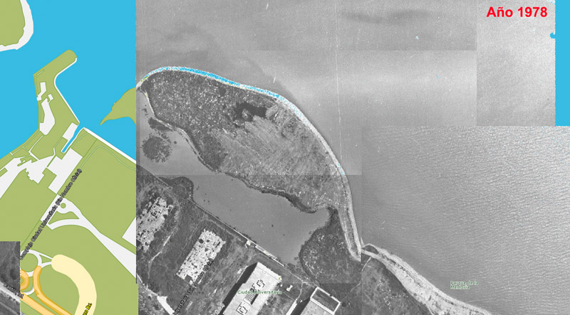
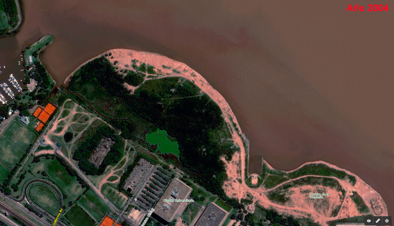
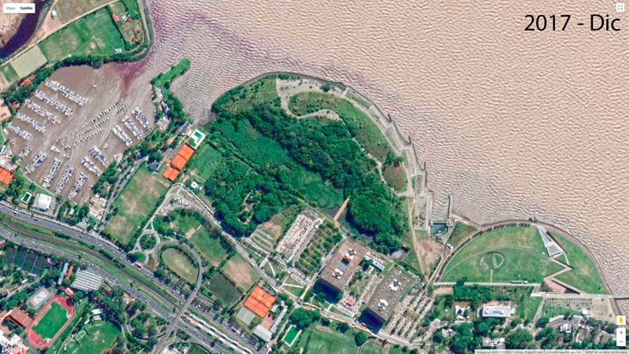

```{r setup, include=FALSE}
knitr::opts_chunk$set(echo = TRUE)
```


## **Introducción**

Si, otra vez nosotros. Seguro ya nos estaban extrañando (?). Es que trabajar con sensores remotos (*A.K.A imágenes satelitales*) es taaaan divertido (dijo nadie nunca) que no podíamos pasarnos ni un segundo más sin mostrarles esta herramienta tan interesante que les vamos a enseñar a continuación. Esta vez vamos a hablar de lo único [invariable en el universo](https://www.youtube.com/watch?v=0khKL3tTOTs "'Cambia, todo cambia' - Mercedes Sosa"): el cambio. Veremos cómo visualizar el cambio en el tiempo y el espacio.

Pero antes de arrancar con el tutorial, hablemos un poquito del área de estudio que estamos usando como ejemplo. Vamos a seguir trabajando con imágenes rasterizadas de la [**Reserva Ecológica Costanera Norte**](http://www.recucn.com.ar/ "RECN"). En la entrega anterior ([Click aquí para acceder a ella](LINK)), les comentamos que esta reserva fue creada recientemente. De hecho, la fecha exacta del convenio entre la Univerisad de Buenos Aires (UBA) y el Gobierno de la Ciudad de Bs. As.(GCBA) para su creación tiene fecha del 15 de mayo de 2018 (¡4 años!).

El territorio de la RECN no es natural, sino que tiene un origen antrópico, ya que se consituye a partir de los escombros y rellenos resultantes de la construcción de la Ciudad Universitaria de la UBA en el año 1969. Los escombros fueron depositados de forma tal que formaron una suerte de península, rodeada por el Rio de la Plata desde el norte y con ingreso de agua desde el noroeste, que forma una suerte de riacho interno.

<center>



</center>

La península se intervino de forma esporádica y anárquica, construyéndose estructuras en algunos momentos (murallones, caminos), aunque la mayor parte del tiempo se dejó sin intervención y, por lo tanto, se dió lugar (sin querer) a la instalación, desarrollo y sucesión de distintos tipos vegetales, tanto ribereños (con elementos de la ecorregión Deltas e Islas del Paraná) como continentales (exóticas y nativas) y a la fauna asociada a ésta y a la CABA (especies tanto nativas como exóticas y/o invasoras).

<center>



</center>

La RECN fue objeto de debate durante mucho tiempo, dado que, a pesar de haber cedido los terrenos de la futura reserva a la UBA, el GCBA pretendía que la zona forme parte del "Circuito Jóven", es decir, la extensión de negocios privados que incluyen discotecas y restaurantes a lo largo de zona costera de la Ciudad de Bs. As (CABA).

<center> 

 
</center>

En el año 2012 se sanciona la ley 4.467 de la Ciudad Autónoma de Buenos Aires, que crea formalmente a la 2° Reserva Ecológica en este distrito: Ciudad Universitaria-Costanera Norte. A partir de ese momento, se abre una disputa por el control de la Reserva. El GCBA pretendía que la RECN sea un parque verde más dentro de la ciudad, es decir, que cumpla principalmente recreativa (en otras palabras, que sirva como parte de la especulación inmobiliaria de la zona). Por el otro lado, estudiantes y docentes utilizabamos la reserva como área de estudio, donde se llevaba adelante avistaje de aves, vegetación, recolección de artrópodos y proyectos de estudio de anfibios, peces y mamíferos.

<center> 
 
</center>

Finalmente, en 2018 se firma un convenio entre la UBA y el GCBA que pone en marcha la gestión y el funcionamiento real de la RECN. En este marco, varios grupos de investigación de la Facultad de Cs. Exáctas y Naturales realizaron un relevamiento de biota y elaboraron un plan de manejo de la RECN. Las imágenes ráster que vamos a utilizar forman parte de ese relavamiento. 

Les agradecemos nuevamente al [Dr. Horacio Sirolli del Grupo de Investigación en Ecología de Humedales](https://www.ege.fcen.uba.ar/investigacion/grupo-de-investigacion-en-ecologia-de-humedales-gieh/ "GIEH") y a la materia de la FCEN [Ecología Ambiental](https://www.ege.fcen.uba.ar/academico/materias-de-grado/materias-del-ciclo-superior-primer-cuatrimestre/materias-del-area-ecologia/ecologia-ambiental/ "Ecología Ambiental") por darnos acceso a estos archivos.

## **Cuantificando los cambios**
La idea de esta entrega es que podamos analizar y graficar de una forma amena los cambios producidos en el actual territorio de la RECN tanto espacial como temporalmente. Para ello vamos a utilizar tres archivos **raster**, cada uno de un momento distinto de la reserva (1978, 2000 y 2020).

Como siempre, borramos la  memoria y seteamos nuestro directorio de trabajo:
```{r, message = FALSE}
rm(list=ls())
setwd("E:/Rodrigo/transiciones y mapas")
```

Vamos a utilizar cuatro paquetes: nuestro querido paquete *terra*, *ggplot2* para plotear rasters (¡Si, otra forma!), *networkD3* para realizar diagramas interactivos y *dplyr* para manipular datos:

```{r, message = FALSE}
library(terra)
library(ggplot2)
library(networkD3)
library(dplyr)
```

Cargamos nuestros rasters:
```{r}
RECN78<-rast("RECU 1978 posgar 6.tif")
RECN20<-rast("RECU 2000 posgar 6.tif")
RECN18<-rast("RECU 2018 posgar 6.tif")
```

Hechémosles una miradita. El de 1978:
```{r fig.align="center"}
colores<-c("blue","black","brown","cyan","green","forestgreen","skyblue","grey") #Vector de colores
par(xpd = FALSE) #parámetro que evita (FALSE) que grafiquemos por fuera de los límites del gráfico
plot(RECN78,
     main= "Prenínsula de relleno, 1978", #le ponemos un título
     col= colores, #le indicamos el vector de colores como el conjunto de colores
     legend=F) 
legend(
  "topright", #Ponemos la leyenda arriba a la derecha
  legend = c("Agua", "Roca/Hormigón", "Suelo desnudo", "Vegetación acuática", "Vegetación herbácea","Vegetación leñosa","Agua interior","Edif.FCEN"),
  fill = colores #rellenamos la leyenda con los colores de las clases de cobertura
  )
```

Veamos el del año 2000:
```{r fig.align="center"}
par(xpd = FALSE) #parámetro que evita (FALSE) que grafiquemos por fuera de los límites del gráfico
plot(RECN20,
     main= "Área en disputa, 2020", #le ponemos un título
     col= colores, #le indicamos el vector de colores como el conjunto de colores
     legend=F) 
legend(
  "topright", #Ponemos la leyenda arriba a la derecha
  legend = c("Agua", "Roca/Hormigón", "Suelo desnudo", "Vegetación acuática", "Vegetación herbácea","Vegetación leñosa","Agua interior","Edif.FCEN"),
  fill = colores #rellenamos la leyenda con los colores de las clases de cobertura
  )
```

Veamos el del año 2018:
```{r fig.align="center"}
par(xpd = FALSE) #parámetro que evita (FALSE) que grafiquemos por fuera de los límites del gráfico
plot(RECN18,
     main= "RECN, 2018", #le ponemos un título
     col= colores, #le indicamos el vector de colores como el conjunto de colores
     legend=F) 
legend(
  "topright", #Ponemos la leyenda arriba a la derecha
  legend = c("Agua", "Roca/Hormigón", "Suelo desnudo", "Vegetación acuática", "Vegetación herbácea","Vegetación leñosa","Agua interior","Edif.FCEN"),
  fill = colores #rellenamos la leyenda con los colores de las clases de cobertura
  )
```

Vemos que hay un aumento en las categorías vegetales a grandes rasgos, una reducción en el agua interna y en el suelo desnudo, pero no es fácil determinar precisamente a dónde fue a parar cada tipo de cobertura. Lo que vamos a hacer es transformar nuestro raster en un *data frame* (recordemos que un raster es una matriz). A su vez, vamos a transformar los valores del *data frame* en factores (son numéricos):

```{r, message = FALSE}
RECN78df<-as.data.frame(RECN78) #hacemos el data frame
colnames(RECN78df)<- c("1978") #cambio el nombre la columna
RECN78df$`1978`<-as.factor(RECN78df$`1978`) #la transformamos en factor

RECN20df<-as.data.frame(RECN20)
colnames(RECN20df)<- c("2000")
RECN20df$`2000`<-as.factor(RECN20df$`2000`)

RECN18df<-as.data.frame(RECN18)
colnames(RECN18df)<- c("2018")
RECN18df$`2018`<-as.factor(RECN18df$`2018`)
```

Cada valor de cada una de las celdas se encuentra en una fila. Nos hemos olvidado completamente de la componente espacial de los datos y estamos manipulando un *data frame* que, en principio, no nos dice nada sobre los cambios. Lo que vamos a hacer ahora es crear otro *data frame* en donde se visualicen los cambios en cantidades de un valor a otro. Es decir, queremos saber cúantas veces el valor 1 siguió como 1, o cambio a 2,3,4,...,8. Para eso, el primer paso es hacer una tabla con el comando *table*. Luego cambiaremos la tabla por un *data frame*. Estos cambios los vamos a cuantficar entre los períodos 1978 a 2000, por un lado, y 2000 a 2018. La columna que tiene el valor pasado será nuestra "fuente"(*source*, en inglés). La columna con el valor presente será nuestro "objetivo"(*target*, en inglés). La cuantificación de los cambios (la frecuencia del cambio) la dejaremos en la columna "value".   


```{r, message = FALSE}
AB<-as.data.frame(AB<-table(RECN78df$`1978`,RECN20df$`2000`),stringsAsFactors = FALSE) #Cambios 1978 a 2000
BC<-as.data.frame(BC<-table(RECN20df$`2000`,RECN18df$`2018`),stringsAsFactors = FALSE) #Cambio 2000 a 2018

colnames(AB)<-c("source","target","value")
colnames(BC)<-c("source","target","value")
```

Veamos cómo quedaron los *data frames*:
```{r, message = FALSE}
head(AB)
```
El valor "1" se convirtió en "1" en 23917 casos (pixeles), el "2" se hizo "1" en 899 pixeles... y así.

## **Manipulando los datos**
Los valores 1, 2, 3... representan clases de cobertura. Volviendo a los gráficos del principio, sabemos que las categorías son las siguientes: **1->Agua**, **2->Roca/Hormigón**,**3->Suelo desnudo**,**4->Vegetación acuática**,**5->Vegetación herbácea**,**6->Vegetación leñosa**,**7->Agua interior**,**8->Edificio de la FCEN**.
Vamos a modificar en nuestros *data frames* para que, en lugar de los valores, aparezcan nuestras coberturas:

```{r, message = FALSE}
AB["source"][AB["source"] == 1] <- "AGUA"
AB["source"][AB["source"] == 2] <- "ROCA/HORMIGON"
AB["source"][AB["source"] == 3] <- "SUELO_DESNUDO"
AB["source"][AB["source"] == 4] <- "VEG_ACUATICA"
AB["source"][AB["source"] == 5] <- "VEG_HERBACEA"
AB["source"][AB["source"] == 6] <- "VEG_LEÑOSA"
AB["source"][AB["source"] == 7] <- "AGUA_INTERIOR"
AB["source"][AB["source"] == 8] <- "CIUD.UNIVER"

AB["target"][AB["target"] == 1] <- "AGUA"
AB["target"][AB["target"] == 2] <- "ROCA/HORMIGON"
AB["target"][AB["target"] == 3] <- "SUELO_DESNUDO"
AB["target"][AB["target"] == 4] <- "VEG_ACUATICA"
AB["target"][AB["target"] == 5] <- "VEG_HERBACEA"
AB["target"][AB["target"] == 6] <- "VEG_LEÑOSA"
AB["target"][AB["target"] == 7] <- "AGUA_INTERIOR"
AB["target"][AB["target"] == 8] <- "CIUD.UNIVER"

BC["source"][BC["source"] == 1] <- "AGUA"
BC["source"][BC["source"] == 2] <- "ROCA/HORMIGON"
BC["source"][BC["source"] == 3] <- "SUELO_DESNUDO"
BC["source"][BC["source"] == 4] <- "VEG_ACUATICA"
BC["source"][BC["source"] == 5] <- "VEG_HERBACEA"
BC["source"][BC["source"] == 6] <- "VEG_LEÑOSA"
BC["source"][BC["source"] == 7] <- "AGUA_INTERIOR"
BC["source"][BC["source"] == 8] <- "CIUD.UNIVER"

BC["target"][BC["target"] == 1] <- "AGUA"
BC["target"][BC["target"] == 2] <- "ROCA/HORMIGON"
BC["target"][BC["target"] == 3] <- "SUELO_DESNUDO"
BC["target"][BC["target"] == 4] <- "VEG_ACUATICA"
BC["target"][BC["target"] == 5] <- "VEG_HERBACEA"
BC["target"][BC["target"] == 6] <- "VEG_LEÑOSA"
BC["target"][BC["target"] == 7] <- "AGUA_INTERIOR"
BC["target"][BC["target"] == 8] <- "CIUD.UNIVER"
```

Ahora le vamos a agregar un identificador con el año a las coberturas correspondientes. De esta forma, podemos distinguir el año de salida y el año de llegada en cada *data frame* y en cada cobertura:
```{r, message = FALSE}
AB$source <- interaction(AB$source, "(1978)", sep = "")
AB$target <- interaction(AB$target, "(2000)", sep = "")

BC$source <- interaction(BC$source, "(2000)", sep = "")
BC$target <- interaction(BC$target, "(2018)", sep = "")
```

Vamos a unir lo *data frames* uno debajo del otro:
```{r, message = FALSE}
ABC<-rbind(AB,BC)
```

Vamos realizar un subgrupo de los datos con los valores que hayan sido mayores a cero (0), es decir, vamos a quitar de nuestro *data frame* los cambios de cobertura que no sucedieron:
```{r, message = FALSE}
names(ABC)
ABC <- subset(ABC, value > 0) #filtramos mediante la columna "value"
```

El paquete *networkD3* utiliza un sistema de nodos para ubicar las fuentes y los objetivos de los cambios. Vamos a generar los nodos a partir del *data frame*, pidiendo que filtre por etiqueta única:
```{r, message = FALSE}
nodes <- data.frame(
  name=c(as.character(ABC$source), 
         as.character(ABC$target)) %>% unique())
```

Además de los nodos, *networkD3* debe reconocer a las fuentes y objetivos como valores numéricos. Para poder señarle eso, vamos a parear (o matchear) las etiquetas de los *data frames* **ABC** con el de **nodes**. Eso nos produce un valor cuando matchea. Para que el valor mínimo sea en 0, le restamos uno (1). Lo que nos quedará finalmente es una "traducción" numérica del las clases de cobertura tanto fuentes como objetivos: 
```{r, message = FALSE}
#Etiquetas del paqute
ABC$IDsource <- match(ABC$source, nodes$name)-1 
ABC$IDtarget <- match(ABC$target, nodes$name)-1
```

## **Diagramas de cambios (Sankey Plot)**
Ya tenemos listo nuestro *data frame* con el que vamos a graficar el diagrama de cambios, también llamado *Sankey Plot*. El comando para realizar el diagrama es *sankeyNetork*. Veamos cómo da:

```{r echo=TRUE, fig.height= 8, fig.width= 13}
a <- sankeyNetwork(Links = ABC, #data frame de vínculos
                   Nodes = nodes, #data frame de nodos 
                   Source = "IDsource", #Fuente numérica
                   Target = "IDtarget", #Objetivo numérico
                   Value = "value",  #Valor del cambio
                   NodeID = "name",  #Identificador del nodo
                   sinksRight=FALSE) #Ubiación de la etiqueta
a
```

El objeto "a" es nuestro diagrama de cambios.  Si nos posamos en los nodos podemos ver desde y/o hacia donde se dirigieron los cambios de cobertura y cuanto representa esa cobertura, en este caso en cantidad de pixeles. Situándonos en el flujo podemos ver, además de la dirección, la cantidad de ese cambio. Como se observa, la parte considerada Ciudad Universitaria (urbana) no cambia con el tiempo. Vamos a crear una base sin esa clase y, de esta forma, visualizar mejor los cambios en las otras clases:

```{r}
ABC2 <- ABC[!(ABC$source %in% c("CIUD.UNIVER(1978)", "CIUD.UNIVER(2000)","CIUD.UNIVER(2018)")),] #creo un data frame filtrando los niveles que tienen a ciudad universitaria como fuente
ABC2 <- ABC2[!(ABC2$target %in% c("CIUD.UNIVER(2000)","CIUD.UNIVER(2018)")),] #filtro el nuevo data frame quitando los niveles que tienen a ciudad universitaria como objetivo
```

El resultado es un nuevo *data frame* sin Ciudad Universitaria como fuente o como objetivo. Creamos nuevamente los nodos y los identificadores:
```{r}
#Rehago los nodos
nodes2 <- data.frame(
  name=c(as.character(ABC2$source), 
         as.character(ABC2$target)) %>% unique())

#Rehago las etiquetas
ABC2$IDsource <- match(ABC2$source, nodes2$name)-1 
ABC2$IDtarget <- match(ABC2$target, nodes2$name)-1
```

Antes de rehacer nuestro diagrama de cambios, vamos asignarle colores a los nodos, de forma  tal que cada cobertura sea más identificable. Primero vamos a ver los niveles de los nodos:
```{r}
nodes2$name<-as.factor(nodes2$name)
levels(nodes2$name)
```
  
Le ponemos colores a las coberturas. PERO PRIMERO LEÉ LA SIGUIENTE ACLARACIÓN:
**¡Alerta! Cada nodo individual tendrá su color. La función d3.scaleOrdinal utilizada para enlazar los nodos con los colores lee el primer término (palabra o cobertura) del nodo. Por ejemplo, si dejo categorías tipo "veg herbacea  y veg leñosa", va a leer solo "veg" y va a pintar todo de un mismo color, sea leñoso o herbaceo. Por eso cada categoría tiene que tener un identificados único y sin espacios**

La función d3.scaleOrdinal() tiene una parte donde se le indica el dominio "domain" y una parte donde se le indica el rango "range". Cada valor del dominio tiene que tener su valor en el rango. Como queremos que una misma cobertura tenga el mismo color a lo largo  de los años, si vemos el rango, todo lo que es "agua interior" es de color celeste ("skyblue").
```{r}
colores <- 'd3.scaleOrdinal() .domain(["AGUA_INTERIOR(2018)", "AGUA_INTERIOR(2000)", "AGUA_INTERIOR(1978)", "AGUA(2018)", "AGUA(2000)", "AGUA(1978)","ROCA/HORMIGON(2018)", "ROCA/HORMIGON(2000)", "ROCA/HORMIGON(1978)", "SUELO_DESNUDO(1978)","SUELO_DESNUDO(2000)", "SUELO_DESNUDO(2018)", "VEG_ACUATICA(2018)",  "VEG_ACUATICA(2000)",  "VEG_ACUATICA(1978)",  "VEG_HERBACEA(1978)",  "VEG_HERBACEA(2000)",  "VEG_HERBACEA(2018)","VEG_LEÑOSA(1978)","VEG_LEÑOSA(2000)","VEG_LEÑOSA(2018)"]) .range(["skyblue", "skyblue" , "skyblue", "blue", "blue", "blue", "grey","grey","grey","brown","brown","brown","black","black","black","yellow","yellow","yellow","green","green","green"])'
```

Ahora volvemos a correr nuestro diagrama de cambios, pero con colores, la letra más grande y sin Ciudad Universitaria:
```{r echo=TRUE, fig.height= 8, fig.width= 13}
p <- sankeyNetwork(Links = ABC2, Nodes = nodes2,
                   Source = "IDsource", Target = "IDtarget",
                   Value = "value", NodeID = "name", 
                   sinksRight=FALSE,
                   units = "pixeles", #le señalamos la unidad
                   fontSize = 12, #tamaño de la letra
                   colourScale = colores) #asignamos los colores
p

```
**¡Mucho más lindo!** Vamos a usar los primeros comandos que vimos en nuestra primera entrega para saber el tamaño de la celda del raster y hacer la conversión de pixeles a m<sup>2</sup> o a hectáreas:
```{r}
cellSize(RECN78)
```
cellSize nos dice que área de cada pixel es de 4m<sup>2</sup>. Creemos una nueva columna en nuestro *data frame* ABC2 multiplicando los valores de la colmuna *value* (la frecuencia de los cambios en pixeles) por este valor de área:

```{r}
ABC2$area<-ABC2$value*4 #en metros cuadrados puede ser poco práctico
```

Graficamos nuestro diagrama de transiciones, ahora en m<sup>2</sup>
```{r echo=TRUE, fig.height= 8, fig.width= 13}
r <- sankeyNetwork(Links = ABC2, Nodes = nodes2,
                   Source = "IDsource", Target = "IDtarget",
                   Value = "area", NodeID = "name", 
                   sinksRight=FALSE,
                   units = "m2",
                   fontSize = 12,
                   colourScale = colores)
r
```

Los valores son muy grandes. Podemos probar transformando los metros cuadrados en hectáreas:
```{r}
ABC2$area2<-ABC2$area/10000 #en hectáreas puede ser más ilustrativo
```

Graficamos nuevamente, ahora en metros cuadrados:
```{r echo=TRUE, fig.height= 8, fig.width= 13}
o <- sankeyNetwork(Links = ABC2, Nodes = nodes2,
                   Source = "IDsource", Target = "IDtarget",
                   Value = "area2", NodeID = "name", 
                   sinksRight=FALSE,
                   units = "ha",
                   fontSize = 12,
                   colourScale = colores)
o
```

Excelente, tenemos una muy linda e interactiva forma de ver los cambios ocurridos en el tiempo con cada clase de cobertura. Sin embargo, este análisis carace de espacialidad, es decir, no sabemos dónde se han producido estos cambios.

## **Cambios en el espacio**
Para poder mapear los cambios en el espacio, vamos a rasterizar un *data frame*. Este raster va a sintetizar los cambios en las coberturas. Como ejemplo, vamos a mapear el cambio en la clase de coberura de suelo desnudo entre 1978 y el 2000 es decir, el cambio parcial. Lo primero que vamos a hacer es extraer los datos de las coordenadas de cada celda del raster, que es igual para todos los raster:

```{r}
coordenadas<-crds(RECN78, df=T, na.rm=TRUE)
```
El objeto coordenadas es un *data frame* de tantas filas como celdas y con las columnas X (longitud) e Y (latitud) de cada una de ellas. En nuestros *data frames* la cobertura *suelo desnudo* toma el valor "3". Vamos a generar un data frame con una pruba lógica: si en el *data frame* de 1978 hay una celda distinta de 3 y en la de 2000 se transforma en 3, entonces nos arroja TRUE y eso simboliza la ganancia de suelo desnudo. Por el contrario, si el valor en 1978 es 3 y en el 2000 es distinto, entonces arroja TRUE pero es perdida. El resultado de esta operación arroja una matriz. En este caso, tenemos una matriz para las pérdidas y una matriz para las ganancias.

```{r}
sdganancia <- RECN78df != 3 & RECN20df == 3 #Prueba lógica: Si el valor en el 78' no es 3 y en el 2000 es 3,entonces TRUE. La celda TRUE es lo que se ganó.

sdperdida <- RECN78df == 3 & RECN20df != 3 #Prueba lógica: Si el valor en el 78' es 3 y en el 2000 no es 3, entonces TRUE.La celda TRUE es la que se perdió.

sdestatico <- RECN78df == 3 & RECN20df == 3 #Prueba lógica: Si el valor en el 78' es 3 y en el 2000 es 3, entonces TRUE. La celda TRUE es lo que sigue siendo suelo desnudo
```

Posteriormente, vamos a sumar las matrices  y aplicarles una corrección para obtener tres valores posibles. Primero, tenemos que resaltar lo siguiente: los valores FALSE (falsos) dentro del álgebra de matrices son traducidos como ceros ("0") y los valores TRUE (verdaderos) como unos ("1"). Sumar FALSE + TRUE = 1. En nuestra suma de matrices, sumamos 1 a todos los elementos. Si "sdperdida" es TRUE, entonces arrojará el valor 2. Luego, "sdganancia" está multiplicado por *2, por lo tanto si "sdganancia" es verdadero (1), ahora tendrá el valor dos (2), y luego se le sumará uno (1), por lo tanto si "sdganancia" es verdadero, tomará el valor tres (3). Lo mismo ocurre con sdestatico, pero su valor final es cuatro (4) ya que está multiplicado por 3. Si las tres matrices son falsas, entonces el valor final será uno (1) y eso indicaría que se trata de otrs coberturas:
```{r}
sdcambios <- 1 + sdperdida + sdganancia * 2 + sdestatico*3 #Toma los valores 1, 2, 3 y 4. 1: otras coberturas, 2: se perdió,  3: se ganó, 4: se mantuvo como suelo desnudo
```

Convertimos a nuestra matriz en un *data frame*, le agregamos las coordenadas de las celdas y le cambiamos los nombres a las columnas:
```{r}
sdcambios_df<-as.data.frame(sdcambios)#hacemos un data frame
sdcambios_df<-cbind(sdcambios_df,coordenadas)#lo unimos con las coordenadas
names_chg <- c("Otras Coberturas", "SD Pérdida", "SD Ganancia", "SD Antes y Ahora") #vector de nombres para la leyenda
```

Hago un vector de colores:
```{r}
cols_chg <- c("lightgrey", "red", "blue", "yellow") #Colores de las clases
```

Finalmente construimos un raster con *ggplot2* de la siguiente manera:
```{r fig.align="center"}
#Construimos un raster con ggplot2
a<-ggplot(sdcambios_df) + #le damos el data frame
  geom_raster(aes(x = x, y = y, fill = as.character(`1978`))) + #señalamos las coordenadas 
  scale_fill_manual(name = "Cambios", #le ponemos nombre
                    values = cols_chg, #el vector de colores
                    labels = names_chg, #el vector de nombres de categorías
                    na.translate = FALSE) +
  coord_sf(expand = F) + #False para que el área graficada sea limitada
  theme(axis.title.x = element_blank(), #Cambios en el fondo
        axis.title.y = element_blank(),
        panel.background = element_rect(fill = "white", color = "black"))
a
```
Jugando con el álgebra de matrices podríamos generar la prueba lógica que nosotros quisiésemos, por ejemplo, podríamos mapear la pérdida de suelo desnudo, mirar el diagrama de cambios y fijarnos cuáles fueron las coberturas por las que fue reemplazado y mapearlas. 

## **Conclusiones**
Hemos visto cómo manipular los raster para hacerlos *data frames* y trabajar con ellos. Pudimos analizar la trayectoria temporal de las distintas clases de cobertura en diferentes tiempos y en distintas unidades. Finalmente, encontramos una forma de mapear esos cambios en el espacio. Estas herramientas son de mucha utilidad cuando se trata de analizar cambios en grandes extensiones y expresar dichos cambios de una manera amena y llamativa. En tiempos de transformaciones constantes en el uso de la tierra, poder mapear temporal y espacialmente esas transformaciones nos brindan conocimiento sobre el impacto de la actividad humana sobre los ecosistemas, por un lado y, por el otro, argumentos para la conservación de aquellas áreas que consideramos valiosas.
