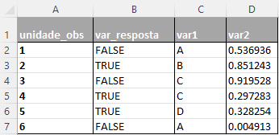
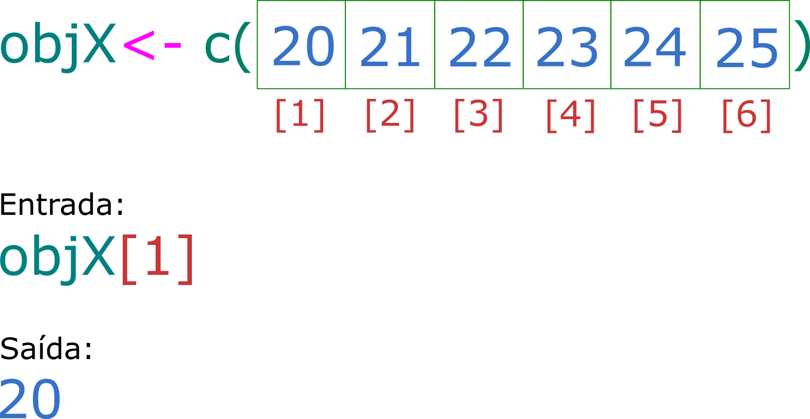

# R para quem tem pressa: Parte I

## (ou R para quem não quer aprender R)


Esse tutorial é para você que precisa aprender **R** por algum motivo de força maior, não sabe absolutamente nada sobre e precisa de um lugar para começar. O objetivo aqui *não* é te ensinar a programar, muito menos te ensinar a fazer análises estatísticas, mas sim te ensinar um pouco sobre o **✨R base✨**.

## O que você precisa para seguir esse tutorial?

Esse tutorial vem acompanhado de Rmarkdown (um "editor de texto" que possibilita a inclusão de códigos de programação em R dentro dele). O markdown e a tabela que usaremos estão disponíveis no meu [GitHub](https://github.com/bellabf/r_pressa) ([O que é um GitHub?](https://www.somaquadrados.com/blog/git/github/)). Como pré-requisitos você precisa [instalar o R, o Rstudio](https://didatica.tech/como-instalar-a-linguagem-r-e-o-rstudio/) e possuir um *tico* (🤏) de disposição.

## Por que R?

R é uma linguagem *open-source* (= você não precisa pagar uma licença para usá-la). FALAR SOBRE IMPORTÂNCIA DO R BASE E DEIXAR A PARTE DOS PACOTES PRA PARTE II.

## O "R Base"

### Objetos

Ao usar R, a primeira coisa que você precisa saber é que letras minúsculas e maiúsculas têm valores diferentes. Ou seja, 'X' e 'x' não são iguais. A segunda informação é que nós armazenamos (ou indexamos) valores com os quais estamos trabalhando em **objetos**.

Criar um objeto é uma forma de "salvar valores" dentro da memória do nosso computador (objeto **→** 🧠💻), tornando possível "chamá-los" para uso quando quisermos. Para atribuir um valor a um objeto, usamos um "operador de atribuição", composto de um sinal de 'menor' e um hífen (`<-`):

<center>

{width="521"}

</center>

No código R, isso é:

```{r}
identificador <- "valor"
```

**Por exemplo**: Quero armazenar o valor "1" em um objeto chamado "a" e o valor "2" em um objeto chamado "A".

```{r}
a <- 1 
A <- 2
```

Sempre que avaliarmos o objeto "a" (⚠ ️**CRTL + Enter** no nome do objeto), o R retornará o valor "1", ...

```{r}
a
```

... e para "A", o valor de "2".

```{r}
A
```

Cada objeto pode armazenar apenas uma estrutura de dados por vez (um valor ou uma sequência de valores).

### Regras para os nomes dos objetos

-   Podem ser compostos de letras, números, "\_" e "." (ex: `dados <- 1`, `dados2 <- 1`, `dados_2 <- 1` e `dados.2 <- 1`)

-   Não pode começar com um número e/ou um ponto (ex: `1dados <- 1` ou `.dados <- 1`)

-   Não pode conter espaços (ex: `dados 2 <- 1`)

-   Evitar o uso de acentuação gráfica (ex: `número <- 1`)

-   Evite usar nomes de funções (ex: `soma`, `diff`, `df`, `var`, `pt`)

-   E lembrar que, como eu já disse, o R diferencia maiúsculas de minúsculas (`obj` ≠ `OBJ` ≠ `Obj`)

### Ok, mas quais são os tipos de valores que podemos atribuir a um objeto?

Os objetos possuem três características: Nome + conteúdo + atributo do conteúdo.

O atributo pode ser dividido em duas categorias: 1. Classe e 2. Estrutura do dado.

#### 1. Classe

A classe é essencial em R! É aqui que funções e operadores podem saber exatamente o que fazer com o(s) objeto(s). Por exemplo, é possível somar dois objetos numéricos, ...

```{r}
a + A
```

... mas não podemos somar dois objetos de tipo caracter.

```{r eval=FALSE, message=FALSE, warning=FALSE, include=TRUE}
b <- "bola"
B <- "Bola"
b + B
```

```{r echo=FALSE, message=FALSE, warning=FALSE}
b <- "bola"
B <- "Bola"
print("Error in b + B : non-numeric argument to binary operator")
```

R tem cinco classes básicas de objetos, também chamados de objetos atômicos, entre elas:

        * Booleanos (ou logical): Valores de verdadeiro ou falso

```{r}
verdade <- TRUE
falso <- FALSE
```

        * Númericos (double ou integer)

```{r}
x <- 1.5
y <- 2
```

        * Valores de caracteres (ou valores string)

```{r}
meu_nome <- 'Isabella'
```

#### Estrutura do objeto

A estrutura de um objeto é a forma como os dados são organizados (unidimensional, bidimensional, apenas números ou caracteres, etc.). As formas mais comuns com as quais trabalhamos são:

      * Vetores: Objeto unidimensional que possui uma única classe de valor. Usamos a função "concatenar" ou c()¹ para atribuir uma série de valores (separador por vírgula) ao objeto de tipo vetor.  

```{r}
vetor <- c("banana", "maça", "uva") 
vetor
```

```{r}
vetor2 <- c(1, 2, 3, 5)
vetor2
```

> <small> ⚠ ¹[A ideia básica de uma função é encapsular um código de programação que pode ser invocado/chamado a qualquer momento. Seu significado e uso são muito semelhantes aos das funções matemáticas; há um nome, uma definição e uma invocação da função](https://www.ime.usp.br/~leo/mac2166/2017-1/introducao_funcoes.html). No final deste tutorial falamos mais sobre funções. ⚠ </small>

        * Listas: Uma lista é uma coleção unidimensional de objetos. Os objetos que compõem uma lista podem conter uma ou mais classes de valores. As listas são criadas ccom a função list(objetoA, objetoB, ...).

```{r}
lista <- list(A, b, vetor, vetor2, meu_nome)
lista
```

> ⚠ Observe que as listas utilizam como "valores" os objetos que foram criados anteriormente. ⚠

        * Dataframe: São objetos bidimensionais - as famosas tabelas linhas x colunas (as que costumamos trabalhar no Excel). Nas colunas temos as variáveis/features e nas linhas nossas unidades observacionais/experimentais.



> É possível criar um dataframe diretamente em R com a função `data.frame(vetor1, vetor2, ...)`; MAS, para facilitar sua vida, veremos como importar um data frame **pronto** para o R na segunda parte deste tutorial✌️.

### E se eu não conseguir identificar qual é o *tipo* do meu objeto?

Apesar de parecer uma pergunta simples, não conhecer o *tipo* do seu objeto é um problema que acontece com certa frequência. Como solução, podemos usar a função `typeof(objeto)`, que determina o tipo ou modo de armazenamento dos valores de qualquer objeto.

```{r}
typeof(verdade)
```

```{r}
typeof(vetor)
```

```{r}
typeof(lista)
```

### Operações

Uma vez que você tem um ou mais objetos salvos, você pode fazer uma série de operações com eles.

Começando pelo mais simples, você pode usar o R como uma ✨**calculadora**✨. Por exemplo, é possível subtrair o valor de **x** do objeto **y** (`y-x`),...

```{r}
x <- 23
y <- 37

y-x
x-y

```

Ou até mesmo multiplicá-los (`x*y`) ou dividi-los (`x/y`).

```{r}
x*y
x/y
```

Você também pode comparar valores. Essas operações precisam de alguns símbolos importantes:

| Símbolo de comparação | Aplicação com dois objetos | Significado            |
|-----------------------|----------------------------|------------------------|
| &                     | `A&B`                      | A e B                  |
| \|                    | `A|B`                      | A ou B                 |
| ==                    | `A==B`                     | A igual B²             |
| !=                    | `A!=B`                     | A diferente de B       |
| !                     | `A!B`                      | A negação B            |
| \>=                   | `A>=B`                     | A maior ou igual a B   |
| \<=                   | `A<=B`                     | A menor ou igual a B   |
| \>                    | `A>B`                      | A maior que B          |
| \<                    | `A<B`                      | A menor que B          |
| :                     | `A:B`                      | De A até B (sequência) |

> **⚠️ Atenção**️:
>
> ²A comparação de valores de objetos sempre é feita com dois iguais em sequência (`objA==objB`). Um único igual (`objA=objB`) é para uso de *atribuição*, ou seja, tem o mesmo valor que "`objA<-objB`".

Ao comparar os valores, a saída será um booleano, ou seja, se a comparação é verdadeira (TRUE) ou falsa (FALSE). Por exemplo:

O valor de **A** (=2) é igual ao de **a** (=1)?

```{r}
A == a
```

O valor de **a** (=1) é menor que o de **A** (=2)?

```{r}
a < A
```

O valor de **A** (=2) e de **a** (=1) são diferentes de **c** (=1)?

```{r}
c <- 1
A&a != c
```

Outra operação interessante que podemos fazer com R é 👉**acessar os valores contidos em um objeto por sua(s) posição(ões)👈**. Para isso, é comum usar colchetes, onde inserimos a posição da qual queremos saber um valor (`nome_objeto[posição]`) e obtemos o valor dessa posição como uma saída.

<center>

{width="493"}

</center>

Vamos replicar o nosso exemplo em código R:

```{r}
objX <- c(20, 21, 22, 23, 24, 25)
objX[1]
```

Se quisermos acessar todos os valores do nosso objeto, exceto uma posição qualquer, podemos usar o símbolo de menos (`nome_objeto[-posição]`). Por exemplo, se quisermos ver todos os valores de objX, exceto o contido na posição 3:

```{r}
objX[-3]
```

Também podemos aplicar operadores matemáticos a vetores em conjunto com a indexação:

-   É possível multiplicar por 2 os elementos entre 1 e 3 de ObjX...

```{r}
objX[1:3]*2
```

> 👆 Observe que multiplicar um vetor é equivalente a multiplicar cada uma de suas entradas pelo valor do multiplicador.

-   ... ou perguntar ao R se os elementos 1 e 5 são iguais a 20.

```{r}
objX[c(1,5)] == 20
```

-   Também podemos aplicar funções que calculam algumas estatísticas de tendência central ou de variabilidade, como a média e variância:

```{r}
mean(objX[2:5])
var(objX[2:5])
```

**Mas e como fazemos para acessar os valores de uma lista?** 🤔

Assim como os vetores: `nome_lista[posição]`! Por exemplo, qual é o terceiro elemento do meu objeto "**lista**"?

```{r}
lista[3]
```

Também é possível acessar diretamente os valores de um objeto em nossa lista usando dois colchetes: `nome_lista[[posição]]`:

```{r}
lista[[3]]
```

Se eu quiser acessar um elemento de um objeto que faz parte de uma lista: `nome_lista[[posição_objeto]][posição_elemento]`. Por exemplo, para acessar o segundo elemento contido no objeto 3 de lista:

```{r}
lista[[3]][2]
```

### Funções em R?

Os **objetos** são nomes que contêm valores (`objeto <- valor`), enquanto **funções** são nomes que contêm um código R (`nome_função()` → `{código R}` → *resultado*). A ideia básica de uma função é encapsular um código que pode ser chamado a qualquer momento em R. (...)

# FIM! 🏃

Espero que a sua experiência tenha sido remotamente agradável e que você tenha menos medo de se aventurar no R 💙. No próximo tutorial, vamos falar sobre pacotes, dataframes, tibbles, tidyverse, dplyr e mais manipulação de dados!
