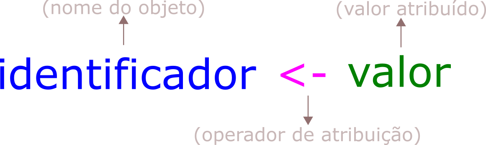

# R para quem tem pressa (ou R para quem não quer aprender R)


Esse tutorial é para você que precisa aprender **R** por algum motivo de força maior, não sabe absolutamente nada sobre e precisa de um lugar para começar. O objetivo aqui *não* é te ensinar a programar, muito menos te ensinar a fazer análises estatísticas, mas sim te ensinar um pouco sobre R e como manipular uma tabela usando dplyr.

## O que você precisa para seguir esse tutorial?

Esse tutorial vem acompanhado de Rmarkdown (um "editor de texto" que possibilita a inclusão de códigos de programação em R dentro dele). O markdown e a tabela que usaremos estão disponíveis no meu [GitHub](https://github.com/bellabf/r_pressa) ([O que é um GitHub?](https://www.somaquadrados.com/blog/git/github/)). Como pré-requisitos você precisa [instalar o R, o Rstudio](https://didatica.tech/como-instalar-a-linguagem-r-e-o-rstudio/) e possuir um *tico* (🤏) de disposição.

## Por que R?

R é uma linguagem *open-source* (= você não precisa pagar uma licença para usá-la). O importante é que, além do que vem com a instalação do R (o que costumamos chamar de *R base*), existe a possibilidade de aumentar a usabilidade da linguagem com o uso de *pacotes*¹. Podemos pensar no R como um super Excel (💪) capaz de lidar com problemas ligeiramente mais complicados de uma maneira mais eficiente.

<small>

> ¹Um pacote R (📦) é uma convenção para organizar e padronizar a distribuição de **funções** extras.
>
> [A ideia básica de uma função é encapsular um código de programação que pode ser invocado/chamado a qualquer momento. Seu significado e uso são muito semelhantes aos das funções matemáticas; há um nome, uma definição e uma invocação da função](https://www.ime.usp.br/~leo/mac2166/2017-1/introducao_funcoes.html). Neste tutorial você aprenderá sobre algumas funções, como concatenação (`c()`) e lista (`list()`).

## Pacotes

Parte do apelo ao R é justamente a flexibilidade das diferentes ferramentas disponíveis em cada um de seus pacotes. Aqui, usaremos dois (o [dplyr](https://dplyr.tidyverse.org/) e o [ggplot](https://ggplot2.tidyverse.org/index.html)), ambos parte do framework do **✨**[Tidyverse](https://www.tidyverse.org/)**✨**.

O Tidyverse é uma coleção obstinada de pacotes R projetados para ciência de dados, ou seja, seus pacotes compartilham uma filosofia de design, gramática e estruturas de dados subjacentes. Neste universo magnífico, dplyr e ggplot são considerados essenciais. Além disso, é possível destacar dois pontos:

1.  Muito do apelo comercial do R vem do tidyverse!
2.  Aprender dplyr te coloca um passo mais próximo de aprender [SQL (uma linguagem de banco de dados amplamente usada)](https://pt.wikipedia.org/wiki/SQL).

## O básico do R

### Objetos

Ao usar R, a primeira coisa que você precisa saber é que letras minúsculas e maiúsculas têm valores diferentes. Ou seja, 'X' e 'x' não são iguais. A segunda informação é que nós armazenamos (ou indexamos) valores com os quais estamos trabalhando em **objetos**.

Criar um objeto é uma forma de "salvar valores" dentro da memória do nosso computador (objeto **→** 🧠💻), tornando possível "chamá-los" para uso quando quisermos. Para atribuir um valor a um objeto, usamos um "operador de atribuição", composto de um sinal de 'menor' e um hífen (`<-`):

<center>

{width="452"}

</center>

No código R, isso é:

```{r}
identificador <- "valor"
```

**Por exemplo**: Quero armazenar o valor "1" em um objeto chamado "a" e o valor "2" em um objeto chamado "A".

```{r}
a <- 1 
A <- 2
```

Sempre que avaliarmos o objeto "a" (⚠ ️**CRTL + Enter** no nome do objeto), o R retornará o valor "1", ...

```{r}
a
```

... e para "A", o valor de "2".

```{r}
A
```

Cada objeto pode armazenar apenas uma estrutura de dados por vez (um valor ou uma sequência de valores).

### Regras para os nomes dos objetos

-   Podem ser compostos de letras, números, "\_" e "." (ex: `dados <- 1`, `dados2 <- 1`, `dados_2 <- 1` e `dados.2 <- 1`)

-   Não pode começar com um número e/ou um ponto (ex: `1dados <- 1` ou `.dados <- 1`)

-   Não pode conter espaços (ex: `dados 2 <- 1`)

-   Evitar o uso de acentuação gráfica (ex: `número <- 1`)

-   Evite usar nomes de funções (ex: `soma`, `diff`, `df`, `var`, `pt`)

-   E lembrar que, como eu já disse, o R diferencia maiúsculas de minúsculas (`obj` ≠ `OBJ` ≠ `Obj`)

### Ok, mas quais são os tipos de valores que podemos atribuir a um objeto?

Os objetos possuem três características: Nome + conteúdo + atributo do conteúdo.

O atributo pode ser dividido em duas categorias: 1. Classe e 2. Estrutura do dado.

#### Classe

A classe é essencial em R! É aqui que funções e operadores podem saber exatamente o que fazer com o(s) objeto(s). Por exemplo, é possível somar dois objetos numéricos, ...

```{r}
a + A
```

... mas não podemos somar dois objetos de tipo caracter.

```{r eval=FALSE, message=FALSE, warning=FALSE, include=TRUE}
b <- "bola"
B <- "Bola"
b + B
```

```{r echo=FALSE, message=FALSE, warning=FALSE}
b <- "bola"
B <- "Bola"
print("Error in b + B : non-numeric argument to binary operator")
```

R tem cinco classes básicas de objetos, também chamados de objetos atômicos, entre elas:

        * Booleanos (ou logical): Valores de verdadeiro ou falso

```{r}
verdade <- TRUE
falso <- FALSE
```

        * Númericos (double ou integer)

```{r}
x <- 1
y <- 2
```

        * Valores de caracteres (ou valores string)

```{r}
meu_nome <- 'Isabella'
```

#### Estrutura do objeto

A estrutura de um objeto é a forma como os dados são organizados (unidimensional, bidimensional, apenas números ou caracteres, etc.). As formas mais comuns com as quais trabalhamos são:

      * Vetores: Objeto unidimensional que possui uma única classe de valor. Usamos a função "concatenar" ou c() para atribuir uma série de valores (separador por vírgula) ao objeto de tipo vetor.  

```{r}
vetor <- c("banana", "maça", "uva") 
vetor
```

```{r}
vetor2 <- c(1, 2, 3, 5)
vetor2
```

        * Listas: Uma lista é uma coleção unidimensional de objetos. Os objetos que compõem uma lista podem conter uma ou mais classes de valores. 

```{r}
lista <- list(A, b, vetor, vetor2, meu_nome)
lista
```

Observe que as listas utilizam como "valores" os objetos que foram criados anteriormente.

        * Dataframe: Tabelas linhas x colunas (aquelas que costumamos trabalhar no Excel)


Veremos como importar um data frame para o R na segunda parte deste tutorial.

### E se eu não conseguir identificar qual é o *tipo* do meu objeto?

Apesar de parecer uma pergunta simples, não conhecer o *tipo* do seu objeto é um problema que acontece com certa frequência. Como solução, você pode perguntar a classe ou estrutura do seu objeto ao R com a função `typeof(objeto)`. Essa função determina o tipo ou modo de armazenamento dos valores de qualquer objeto.

```{r}
typeof(verdade)
```

```{r}
typeof(vetor)
```

```{r}
typeof(lista)
```

### Operações

Uma vez que você tem um ou mais objetos salvos, você pode fazer uma série de operações com eles.

Começando pelo mais simples, você pode usar o R como uma ✨**calculadora**✨. Por exemplo, é possível subtrair o valor de **x** do objeto **y** (`y-x`),...

```{r}
x <- 23
y <- 37

y-x
x-y

```

Ou até mesmo multiplicá-los (`x*y`) ou dividi-los (`x/y`).

```{r}
x*y
x/y
```

Você também pode comparar valores. Essas operações precisam de alguns símbolos importantes:

     * & *:* significa E 
     * | *:* significa ou
     * == *:* significa igual

> **⚠️ Atenção ⚠**️:
>
> A comparação de valores de objetos sempre é feita com dois iguais em sequência (`objA==objB`). Um único igual (`objA=objB`) é para uso de *atribuição*, ou seja, tem o mesmo valor que "`objA<-objB`".

     * != *:* diferença
     * ! *:* negação
     * >= *:* maior igual
     * <= *:* menor igual
     * > *:* maior que
     * < *:* menor que
     * ':' *:* sequência 
     

Ao comparar os valores, a saída será um booleano, ou seja, se a comparação é verdadeira (TRUE) ou falsa (FALSE). Por exemplo:

O valor de **A** (=2) é igual ao de **a** (=1)?

```{r}
A == a
```

O valor de **a** (=1) é menor que o de **A** (=2)?

```{r}
a < A
```

O valor de **A** (=2) e de **a** (=1) são diferentes de **c** (=1)?

```{r}
c <- 1
A&a != c
```

Outra operação interessante que podemos fazer com R é 👉**acessar os valores contidos em um objeto por sua(s) posição(ões)👈**. Para isso, é comum usar colchetes, onde inserimos a posição da qual queremos saber um valor (`nome_objeto[posição]`) e obtemos o valor dessa posição como uma saída.

<center>

{width="493"}

</center>

Vamos replicar o nosso exemplo em código R:

```{r}
objX <- c(20, 21, 22, 23, 24, 25)
objX[1]
```

Se quisermos acessar todos os valores do nosso objeto, exceto uma posição qualquer, podemos usar o símbolo de menos (`nome_objeto[-posição]`). Por exemplo, se quisermos ver todos os valores de objX, exceto o contido na posição 3:

```{r}
objX[-3]
```

Também podemos aplicar operadores matemáticos a vetores em conjunto com a indexação:

-   É possível multiplicar os elementos entre 1 e 3 de ObjX por 2...

```{r}
objX[1:3]*2
```

> 👆 Observe que multiplicar um vetor é equivalente a multiplicar cada uma de suas entradas pelo valor do multiplicador.

-   ... ou perguntar ao R se os elementos 1 e 5 são iguais a 20.

```{r}
objX[c(1,5)] == 20
```

-   E também podemos aplicar funções que calculam algumas estatísticas de tendência central ou de variabilidade, como a média e variância:

```{r}
mean(objX[2:5])
var(objX[2:5])
```

**Mas e como fazemos para acessar os valores de uma lista?** 🤔

Assim como os vetores: `nome_lista[posição]`! Por exemplo, qual é o terceiro elemento do meu objeto "**lista**"?

```{r}
lista[3]
```

Também é possível acessar diretamente os valores de um objeto dentro de uma usando dois colchetes: `nome_lista[[posição]]`:

```{r}
lista[[3]]
```

Se eu quiser acessar o 2o elemento do objeto 3 que faz parte da **lista**: `nome_lista[[posição_objeto]][posição_elemento]`.

```{r}
lista[[3]][2]
```

## Importando dados para o R

Mas que tal facilitar a sua vida? Quanto menos esforço você colocar para importar e manipular dados com sucesso, melhor será a sua transição para o R. É mais fácil organizar seus dados em um programa como Excel ou Google docs do que fazer esse esforço diretamente em R (ou qualquer outra linguagem). Para isso, eu recomendo que você adote algumas boas práticas:

-   Variáveis vão nas colunas.

-   Unidades observacionais ou experimentais nas linhas.

-   Apenas um valor por célula (coluna vs. linha = 1 valor).

    

-   Evite usar caracteres especiais e espaços no nome de colunas. Exemplo: prefira **endereco** no lugar de **endereço**, **dia_coleta** no lugar de **dia coleta**.

-   Não preencha valores faltantes (os famosos NA's) com zeros.

-   Salve suas planilhas em formato **.csv**, **.tsv** ou em **.txt**. Isso facilita a importação para o R.

-   Não coloque comentários ou a unidade métrica nos seus dados. ⚠️Dica: se você estiver medindo algo em centímetros, nomeie a coluna como **nomevariavel_cm**.

-   Para variáveis categóricas nominais, verifique se os nomes correspondentes à mesma característica estão escritos da mesma forma. Se, por exemplo, você está nomeando países e escreve Brasil de duas formas diferentes (numa linha Brasil e em outra brasil), R entenderá que são valores diferentes.

-   Quando analisamos dados, geralmente trabalhamos com objetos de duas dimensões (linhas vs. colunas). Por isso, ao preencher uma planilha, lembre-se de usar apenas uma aba do seu editor; caso contrário, você terá que despender um esforço mais significativo para importar e juntar os dados.

-   Não sublinhe ou use cores em sua planilha; essas formatações não são importáveis ao R.

### Iris

⚠️ Neste tutorial, trabalharemos com uma famosa planilha de dados - a **iris.csv** - que obedece a todas as regras e dicas pré-estabelecidas ([baixe aqui](https://github.com/bellabf/r_pressa)). Ao baixar **iris.csv**, salve-a na mesma pasta do seu computador que está sendo mantindo o seu script R. Você pode verificar qual é o endereço deste diretório com o seguinte comando:

```{r eval=FALSE, message=FALSE, warning=FALSE, include=TRUE}
getwd()

```

O conjunto de dados de íris fornece as medidas (em centímetros) do comprimento e largura da sépala e da pétala para três espécies de irís (Setosa, Versicolor e Virginia), totalizando 150 indivíduos.

{width="660"}

Após salvar a planilha no seu diretório, você deve usar a função `read.csv('nome_planilha.csv')` para importar a iris ao R.

```{r}
dados <- read.csv("iris.csv")
dim(dados)
```

Ao chamar o nome da tabela "iris", R exibirá seu conteúdo: quatro colunas contendo as medidas das sépalas (sepal.length e sepal.width) e pétalas (petal.length e petal.width), uma coluna contendo o nome das espécies de íris (species) e 150 linhas referentes aos indivíduos florais medidos.

```{r echo=FALSE, message=FALSE, warning=FALSE}
library(kableExtra)
library(tidyverse)
iris %>% 
  kbl() %>%
  kable_styling(bootstrap_options = c("striped", "hover", "condensed")) %>%
  scroll_box(height = "300px")
```

## Instalando pacotes e carregar uma biblioteca

Vamos aumentar a funcionalidade do R instalando o Tidyverse para uso do pacote **dplyr**.

Para instalar um pacote em R, executamos a função `install.packages("nome_do_pacote")`. ⚠ Nome do pacote **entre aspas**!! ⚠️

```{r eval=FALSE, message=FALSE, warning=FALSE, include=TRUE}
install.packages("tidyverse")
```

Após a instalação do tidyverse, é necessário invoca-lo para uso de suas funções. Para isso, usamos a função `library(nome_do_pacote)`. ⚠️ Nome do pacote **sem aspas**!! ⚠️

```{r}
library(tidyverse)
```

## Manipulando dados

O **dplyr** é um pacote projetado para a manipulação de **dataframes**. Suas funções permitem que o gerenciamento de dados seja intuitivo e amigável. Com o dplyr, operamos diretamente os dataframes; contrário ao R base que atua sobre os vetores.


O dplyr trabalha com uma gramática de manipulação de dados na qual os verbos ditam certas ações. Cada verbo tem a sua função equivalente. Os verbos mais comuns são:

#### MUTATE

    Adiciona novas varíaveis em função de outras (como, por exemplo, percentagem).

#### SELECT

    Seleciona variáveis baseada no nome.

#### FILTER

    Seleciona variáveis baseada em valores.

#### SUMMARIZE

    Resume variavéis em valores únicos (como média).

#### ARRANGE

    Orderna as linhas da tabela.

O tidyverse tem mais um símbolo "%\>%" ou "\|\>": o pipe. Ele permite agrupar várias operações que seriam realizadas separadamente em um única operação de maneira mais intuitiva. Todos os comandos que usaremos nesse tutorial serão escritos nesse estilo.

\*BÔNUS: se você tem planos de aprender SQL no futuro, dplyr vai ter colocar no caminho certo.

### Tutorial do dplyr

Você pode obter os valores de média para sépalas e pétalas a partir da tabela iris usando o summarise.

```{r}
medias <- dados %>%
          summarise(mean_sepal = mean(Sepal.Length), 
                    mean_petal = mean(Petal.Length))
medias

```

O problema é que dentro dessa tabela, não existem apenas uma espécie de flor. Para isso, a gente pode combinar o group_by com o summarise.

```{r}
medias_especies <- dados %>%
                    group_by(Species) %>%
                    summarise(mean_sepal = mean(Sepal.Length), 
                              mean_petal = mean(Petal.Length))

medias_especies

```

A gente pode modificar o código anterior para temos mais informações como desvio padrão e mediana usando funções auxiliares.

```{r}
medias_especies <- dados %>%
  group_by(Species) %>%
  summarise(mean_sepal = mean(Sepal.Length), 
            mean_petal = mean(Petal.Length), 
            median_sepal = median(Sepal.Length),
            median_petal = median(Petal.Length),
            sd_sepal = sd(Sepal.Length),
            sd_petal = sd(Petal.Length),
            n = n())

medias_especies

```

## Salvando seus dados

Por último, você pode exportar a sua tabela medias_especies usando a função *write.csv*.

```{r}
write.csv(medias_especies, "medias_especies.csv")

```

### E fim!

Se você chegou aqui, você teve uma primeira experiência em R que eu espero que tenha sido remotamente agradável e que você esteja menos aterrorizado de se aventurar em R. No próximo, tutorial, nos vamos explorar a mesma tabela de outras formasa, então fique atento.
