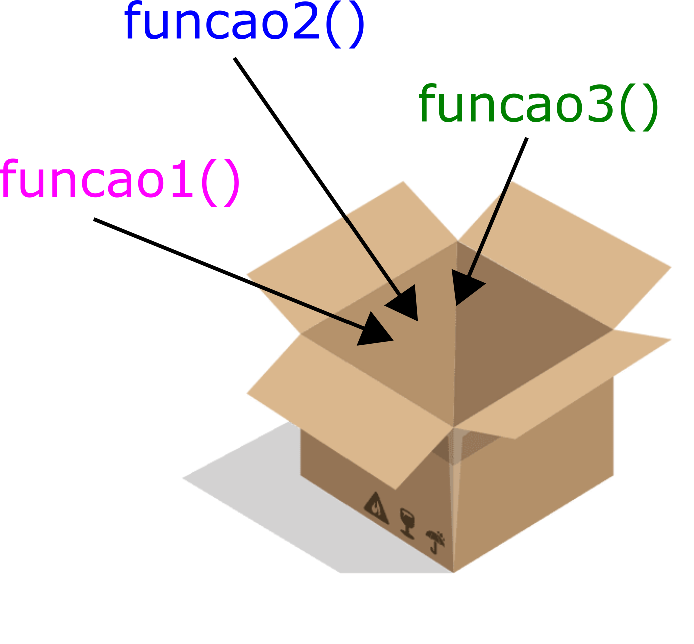
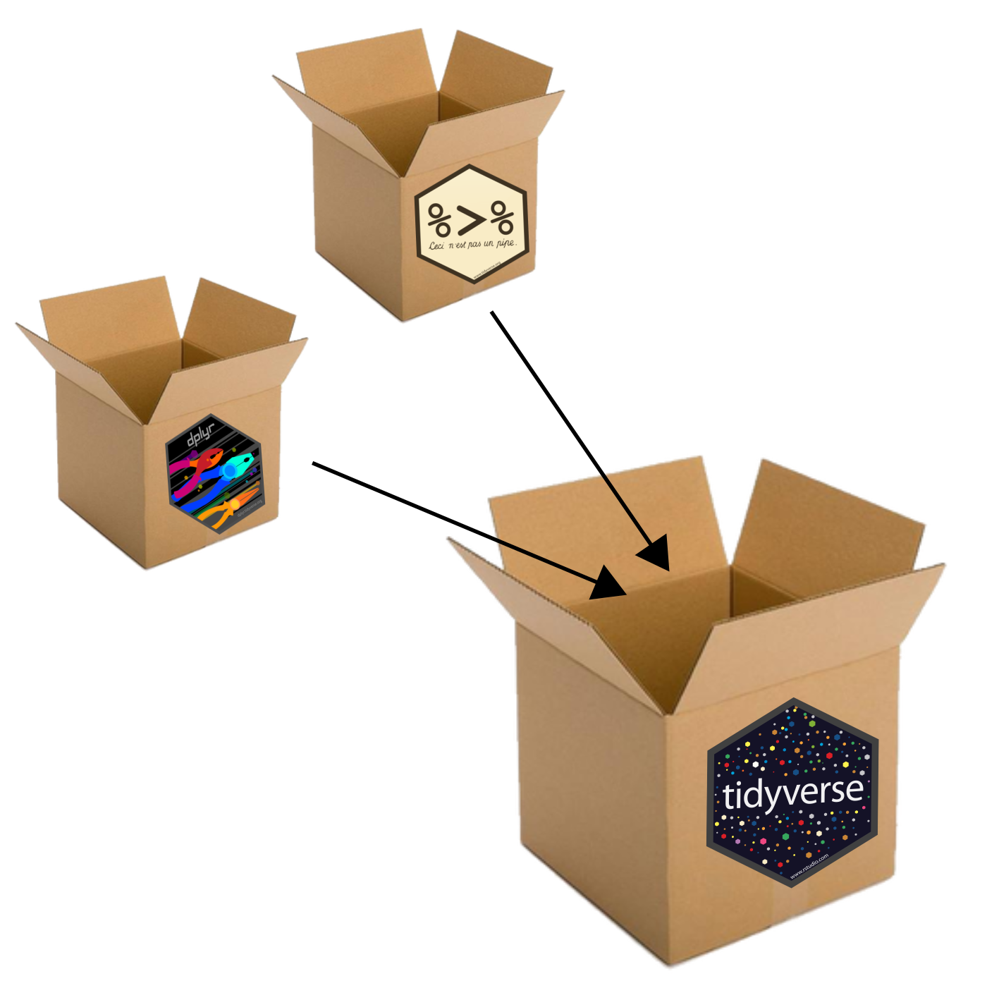
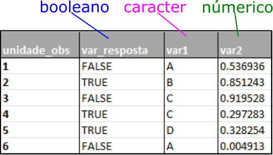

# R para quem tem pressa: Parte II

## (ou R para quem não quer aprender R)


Esse tutorial é para você que precisa aprender **R** por algum motivo de força maior, não sabe absolutamente nada sobre e precisa de um lugar para começar. O objetivo aqui *não* é te ensinar a programar, muito menos te ensinar a fazer análises estatísticas, mas sim te ensinar um pouco sobre o R, o pipe e como manipular um dataframe.

## O que você precisa para seguir esse tutorial?

Esse tutorial vem acompanhado de Rmarkdown (um "editor de texto" que possibilita a inclusão de códigos de programação em R dentro dele). O markdown e a tabela que usaremos estão disponíveis no meu [GitHub](https://github.com/bellabf/r_pressa) ([O que é um GitHub?](https://www.somaquadrados.com/blog/git/github/)). Como pré-requisitos você precisa [instalar o R, o Rstudio](https://didatica.tech/como-instalar-a-linguagem-r-e-o-rstudio/) e possuir um *tico* (🤏) de disposição.

## Por que R?

R é uma linguagem *open-source* (= você não precisa pagar uma licença para usá-la). O importante é que, além do que vem com a instalação do R (o que costumamos chamar de *R base*), existe a possibilidade de aumentar a usabilidade da linguagem com o uso de *pacotes*¹. Podemos pensar no R como um super Excel (💪) capaz de lidar com problemas ligeiramente mais complicados de uma maneira mais eficiente.

## Pacotes 📦

Um pacote é uma convenção para organizar, padronizar e distribuir **funções** extras do R. A principal motivação para criar um pacote é organizar e compartilhar funções de métodos e/ou implementações recém-criadas que sejam úteis para outras pessoas.

<center>

{width="329"}

</center>

Parte do apelo ao R é justamente a flexibilidade das diferentes ferramentas disponíveis em cada um de seus pacotes. Aqui, usaremos dois ([magrittr](https://magrittr.tidyverse.org/) e [dplyr](https://dplyr.tidyverse.org/)), ambos parte do framework do **✨**[Tidyverse](https://www.tidyverse.org/)**✨**.

{width="512"}

O Tidyverse é uma coleção obstinada de pacotes R projetados para ciência de dados, ou seja, seus pacotes compartilham uma filosofia de design, gramática e estruturas de dados subjacentes. Neste universo magnífico, magrittr e dplyr são considerados essenciais. Além disso, é possível destacar dois pontos:

1.  Muito do apelo comercial do R vem do tidyverse!
2.  Aprender dplyr te coloca um passo mais próximo de aprender [SQL (uma linguagem de banco de dados amplamente usada)](https://pt.wikipedia.org/wiki/SQL).

### Instalar e carregar o Tidyverse

Para instalar um pacote em R, executamos a função `install.packages("nome_do_pacote")`.

> ⚠️Nome do pacote **entre aspas**!! ⚠️

```{r eval=FALSE, message=FALSE, warning=FALSE, include=TRUE}
install.packages("tidyverse")
```

Após a instalação do tidyverse, é necessário invoca-lo para uso de suas funções. Para isso, usamos a função `library(nome_do_pacote)`.

> ⚠️ Nome do pacote **sem aspas**!! ⚠️

```{r}
library(tidyverse)
```

> ⚠️ Ao invocar o Tidyverse, o pacote Dplyr é carregado automaticamente. Você também pode executar diretamente `library(dplyr)` se quiser 👩‍💻.

FALAR SOBRE PACOTE::FUNCAO() AQUI??

## Pipe

FALAR DO PACOTE magrittr E ENTÃO DO PIPE..

O tidyverse tem mais um símbolo "%\>%" ou "\|\>": o pipe. Ele permite agrupar várias operações que seriam realizadas separadamente em um única operação de maneira mais intuitiva.

Fazer empanadas **sem** o pipe:

```{r eval=FALSE, message=FALSE, warning=FALSE, include=TRUE}
enfriarse(
  hornear(
    cerrar_la_masa(
      agregar_relleno(
        abre_la_massa(
          mezclar(
            hacer_la_masa(rep(farina, 5), manteca, sal, agua_tibia),
            hasta = 'masa homogénea'),
          tipo = "carne picada"),
      ),
    ),
    temperatura = 180, tiempo = 20),
)
```

Fazer empanadas **com** o pipe:

```{r eval=FALSE, message=FALSE, warning=FALSE, include=TRUE}
hacer_la_masa(rep(farina, 5), manteca, sal, agua_tibia) %>%
  mezclar(hasta = 'masa homogénea') %>%
  abre_la_massa() %>%
  agregar_relleno(tipo = "carne picada") %>%
  cerrar_la_masa() %>%
  hornear(temperatura = 180, tiempo = 20) %>%
  enfriarse()
```

> ⚠️ Todos os comandos que usaremos nesse tutorial serão escritos com o pipe (%\>%).

## Importando dados para o R

Na [versão I](incluirlink) deste tutorial você aprendeu a lidar com vetores e listas. Nesta parte II vamos aprender como importar e gerenciar dataframes. Lembrando que dataframes são objetos bidimensionais e que podem conter uma classe de valor por coluna.

{width="327"}

Para facilitar sua vida - e sua transição para o R - aconselhamos que você crie suas planilhas diretamente em um editor externo (como Excel ou Google Sheets) e depois importe-as para o R. Para isso, algumas boas práticas são recomendadas:

-   As variáveis vão em colunas - uma coluna por variável.

-   Unidades observacionais ou experimentais vão nas linhas.

-   Incluir apenas um valor por célula (coluna vs. linha = 1 valor).

    

-   Evite usar caracteres especiais ou espaço no nome de colunas. Exemplo: prefira **endereco** no lugar de **endereço** e **dia_coleta** no lugar de **dia coleta**.

-   Não preencha valores faltantes (os famosos NA's) com zeros.

-   Salve suas planilhas em formato **.csv**, **.tsv** ou em **.txt**. Isso facilita a importação para o R.

-   Não coloque comentários ou a unidade métrica nos seus dados.

    -   Dica: se você estiver medindo algo em centímetros, nomeie a coluna como **nomevariavel_cm**.

-   Para variáveis categóricas nominais, verifique se os nomes correspondentes à mesma característica estão escritos da mesma forma. Se, por exemplo, você está nomeando países e escreve Brasil de duas formas diferentes (numa linha Brasil e em outra brasil), R entenderá que são valores distintos.

-   Quando analisamos dados, geralmente trabalhamos com objetos de duas dimensões (linhas vs. colunas). Por isso, ao preencher uma planilha, lembre-se de usar apenas uma aba do seu editor; caso contrário, você terá que despender um esforço mais significativo para importar e juntar os dados.

-   Não sublinhe ou use cores em sua planilha; essas formatações não são importáveis ao R.

### Iris

Neste tutorial, trabalharemos com uma famosa planilha de dados - a **iris.csv** - que obedece a todas as regras e dicas pré-estabelecidas ([baixe aqui](https://github.com/bellabf/r_pressa)). Ao baixar a **iris.csv**, salve-a na mesma pasta do seu computador que está sendo mantindo o seu script R. Você pode verificar qual é o endereço deste diretório com o seguinte comando:

```{r eval=FALSE, message=FALSE, warning=FALSE, include=TRUE}
getwd()
```

```{r echo=FALSE, message=FALSE, warning=FALSE}
print("C:/user/docs/rpressa")
```

O conjunto de dados de íris fornece as medidas (em centímetros) do comprimento e largura da sépala e da pétala para três espécies de irís (Setosa, Versicolor e Virginia), totalizando 150 indivíduos.

{width="660"}

Após salvar a planilha no seu diretório, você deve usar a função `read.csv('nome_planilha.csv')` para importar a iris ao R.

```{r}
iris <- read.csv("iris.csv")
```

Ao chamar o nome da tabela "iris", R exibirá seu conteúdo: quatro colunas contendo as medidas das sépalas (sepal.length e sepal.width) e pétalas (petal.length e petal.width), uma coluna contendo o nome das espécies de íris (species) e 150 linhas referentes aos indivíduos florais medidos.

```{r eval=FALSE, message=FALSE, warning=FALSE, include=TRUE}
iris
```

```{r echo=FALSE, message=FALSE, warning=FALSE}
library(kableExtra)
library(tidyverse)
iris %>% 
  kbl() %>%
  kable_styling(bootstrap_options = c("striped", "hover", "condensed")) %>%
  scroll_box(height = "300px")
```

## Manipulando um dataframe com o dplyr

O **dplyr** é um pacote projetado para a manipulação de **dataframes**. Suas funções permitem que o gerenciamento de dados seja intuitivo e amigável.

{width="596"}

O dplyr trabalha com uma gramática de manipulação de dados na qual os verbos ditam certas ações. Cada verbo tem a sua função equivalente. Os verbos mais comuns são:

#### MUTATE

    Adiciona novas varíaveis em função de outras (como, por exemplo, percentagem).

INCLUIR O CÓDIGO EM R

#### SELECT

    Seleciona variáveis baseada no nome.

INCLUIR O CÓDIGO EM R

#### FILTER

    Seleciona variáveis baseada em valores.

INCLUIR O CÓDIGO EM R

#### SUMMARIZE

    Resume variavéis em valores únicos (como média).

INCLUIR O CÓDIGO EM R

**GROUP BY**

EXPLICACAO

USO

#### ARRANGE

    Orderna as linhas da tabela.

INCLUIR O CÓDIGO EM R

## Exemplo 1 - sumarizando dados

Você, pesquisador da área de botânica, deseja obter o tamanho médio das sépalas e pétalas da íris. Para isso, você pode usar a função `summarise(nome_coluna = mean(coluna))`:

```{r}
iris %>%
  summarise(mean_sepal = mean(Sepal.Length), 
  mean_petal = mean(Petal.Length))
```

O problema é que existem três espécies de irís, e você quer saber a média de cada uma delas. Para isso você pode combinar a função `group_by(coluna_grupos)` (que irá agrupar as espécies) com o `summarise(nome_coluna = mean(coluna))` (que vai calcular a média).

```{r}
iris %>%
  group_by(Species) %>%
  summarise(mean_sepal = mean(Sepal.Length), 
  mean_petal = mean(Petal.Length))
```

Por fim, você pode incluir uma medida de variabilidade para acompanhar a sua média. Como de costume em artigos científicos e relatórios, você pode usar o desvio padrão.

```{r}
iris %>%
  group_by(Species) %>%
  summarise(mean_sepal = mean(Sepal.Length), 
            mean_petal = mean(Petal.Length), 
            sd_sepal = sd(Sepal.Length),
            sd_petal = sd(Petal.Length))
```

### Salvando seus dados

Se você deseja salvar a tabela contendo a média e o desvio padrão em um arquivo importável para excel, a primeira coisa que você precisa fazer é atribuir toda a função construída ao nome de um objeto:

```{r}
tab <- iris %>%
  group_by(Species) %>%
  summarise(mean_sepal = mean(Sepal.Length), 
            mean_petal = mean(Petal.Length), 
            sd_sepal = sd(Sepal.Length),
            sd_petal = sd(Petal.Length))
```

Por último, você pode exportar a sua tabela usando a função `write.csv(objeto, "nome_objeto.csv")`.

```{r}
write.csv(medias_especies, "medias_especies.csv")
```

## Exemplo II: Selecionar, filtrar e reordenar os valores de iris

INCLUIR UM EXEMPLO SELECIONANDO SÓ COLUNAS DESEJADAS, FILTRANDO POR ESPÉCIE E ORDENANDO VALORES DE PETALA OU SELAPA EM ORDEM CRESCENTE.

# FIM! 🏃

Espero que a sua experiência tenha sido remotamente agradável e que você tenha menos medo de se aventurar no R 💙. No próximo tutorial, DESCREVER O QUE TERÁ NO PRÓXIMO.
